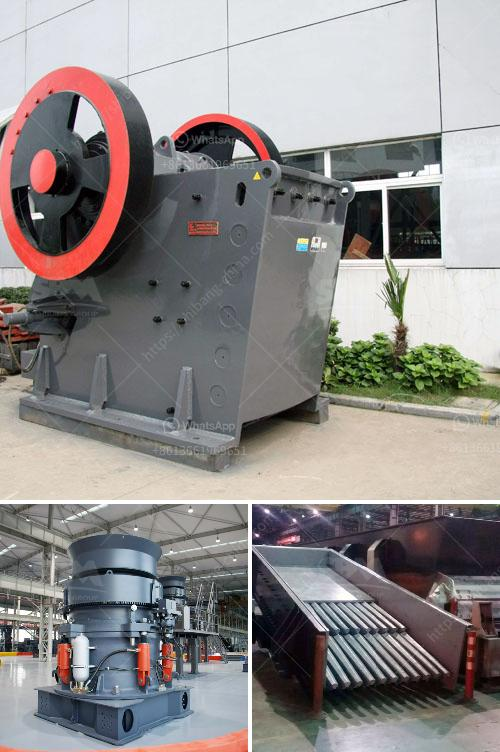

<h3>roller mill grinding roller</h3>
Roller mill grinding rollers are key components of the grinding chamber. In a typical roller mill, the grinding rollers spin alongside the grinding table at a designated speed to pulverize the raw materials into fine powders. Roller mill grinding rollers are usually made of high-quality alloy steel, which ensures their durability and long-term performance.

The grinding rollers play a crucial role in the efficient functioning of a roller mill. They are responsible for grinding the raw materials, such as coal, limestone, clay, and minerals, into the desired fineness. The grinding process is achieved by the rotation of the grinding rollers, which exert force and pressure on the raw materials, causing them to break down and reduce in size.

One of the key advantages of roller mill grinding rollers is their ability to handle a wide range of raw materials. Whether it is hard or soft materials, roller mill grinding rollers can effectively grind them to the required fineness. This versatility makes roller mills a popular choice in various industries, including cement, mining, and minerals processing.

Another crucial aspect of roller mill grinding rollers is their reliability and low maintenance requirements. Properly maintained grinding rollers can withstand heavy loads and high temperatures without wearing out quickly. This durability ensures consistent and reliable performance, reducing downtime and maintenance costs.

To ensure optimum grinding performance, it is essential to regularly inspect and maintain the grinding rollers. This includes monitoring the wear and tear of the rollers, maintaining proper lubrication, and replacing any damaged or worn-out parts promptly. Regular maintenance not only prolongs the lifespan of the grinding rollers but also helps to achieve the desired grind quality and efficiency.

Furthermore, advancements in roller mill technology have led to the development of innovative designs and features for the grinding rollers. For example, some roller mills incorporate segmented grinding rollers, which allow for easier replacement of worn-out segments, reducing maintenance time and costs. Additionally, some roller mill designs feature variable speed drives for the rollers, allowing for more precise control over the grinding process and enabling operators to optimize the mill's performance.

In conclusion, roller mill grinding rollers are essential components that enable efficient and reliable grinding in roller mills. Their durability, versatility, and low maintenance requirements make them a popular choice in various industries. By properly maintaining and inspecting the grinding rollers, operators can ensure prolonged lifespan, consistent performance, and optimal grinding quality. With the continual advancements in roller mill technology, we can expect further improvements in the design and functionality of grinding rollers, leading to even more efficient and cost-effective grinding processes.
<h3>Contact us</h3><ul><li><strong>Whatsapp:&nbsp;<a href="https://wa.me/8613661969651">+8613661969651</a></strong></li><li><a href="https://swt.shibang-china.com/?git&amp;zhl&amp;roller mill grinding roller"><strong>Online Service(chat now)</strong></a></li></ul><h3>Related</h3><ul><li><a href='stone crusher plant operator job.md'>stone crusher plant operator job</a></li><li><a href='flow chart gypsum production.md'>flow chart gypsum production</a></li><li><a href='30 x 42 portable jaw crusher for sale.md'>30 x 42 portable jaw crusher for sale</a></li><li><a href='jaw crusher shanghai.md'>jaw crusher shanghai</a></li><li><a href='hammer mill production location in nigeria.md'>hammer mill production location in nigeria</a></li></ul>