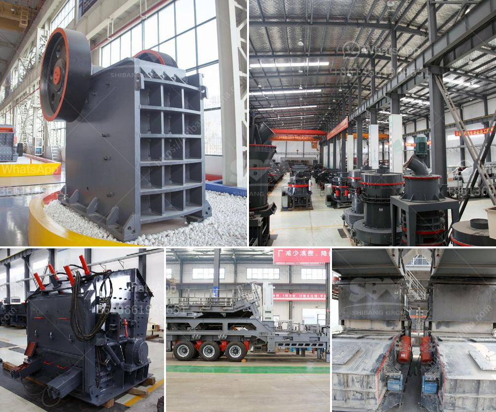

<h3>roller mill sahibabad</h3>
In the heart of Sahibabad, a small town in the state of Uttar Pradesh, India, lies the Roller Mill Sahibabad, a revolutionary entity that has brought significant changes to the manufacturing industry. This state-of-the-art facility has become a game-changer, transforming the way products are manufactured and setting new standards in quality, efficiency, and sustainability.

The Roller Mill Sahibabad is a technological marvel, a result of years of research and development by a team of brilliant engineers and scientists. It is a machine that takes raw materials and processes them into a fine powder or a granular form, using a series of powerful rollers. This process is known as grinding, and it plays a crucial role in the manufacturing of various products, from cement to flour and everything in between.

One of the key features of the Roller Mill Sahibabad is its ability to grind materials with exceptional precision. The machine operates at high speeds, allowing for a controlled and uniform grinding process. This ensures that the resulting powder or granules have consistent particle sizes, which is essential for many industries where the quality and performance of the final product are critical.

Another significant advantage that the Roller Mill Sahibabad brings to manufacturers is its high efficiency. Traditional grinding methods often result in significant energy losses due to friction and other inefficiencies. However, this state-of-the-art machine has been engineered to minimize energy wastage and maximize productivity. It consumes significantly less power while achieving superior grinding performance. This not only translates into cost savings for manufacturers but also helps reduce their carbon footprint, contributing to a greener and more sustainable future.

The Roller Mill Sahibabad is a versatile tool, capable of grinding a wide range of materials. From grains and spices to minerals and chemicals, the machine can handle various types of raw materials with ease. This flexibility has made it a popular choice across different industries, enabling manufacturers to streamline their production processes and diversify their product offerings, all while maintaining the highest quality standards.

Moreover, the Roller Mill Sahibabad is designed to be user-friendly, with advanced automation features that simplify the operation and maintenance processes. It is equipped with intelligent controls and monitoring systems that allow operators to monitor the grinding process in real-time, make adjustments, and troubleshoot any issues quickly. This not only improves efficiency but also reduces human error, ensuring consistent and reliable performance.

The impact of Roller Mill Sahibabad on the manufacturing industry cannot be overstated. It has revolutionized the way products are made, enabling manufacturers to produce higher quality goods, increase productivity, and reduce costs. Furthermore, its energy-efficient design contributes to a greener and more sustainable manufacturing sector.

As the demand for high-quality products continues to grow, the need for advanced grinding technology becomes increasingly vital, and the Roller Mill Sahibabad has emerged as the answer. It represents a significant step forward in the manufacturing industry, delivering innovation and efficiency in a world where excellence is paramount. With its exceptional performance and numerous benefits, it is no wonder that Roller Mill Sahibabad has become the go-to choice for manufacturers worldwide.
<h3>Contact us</h3><ul><li><strong>Whatsapp:&nbsp;<a href="https://wa.me/8613661969651">+8613661969651</a></strong></li><li><a href="https://swt.shibang-china.com/?git&amp;zhl&amp;roller mill sahibabad"><strong>Online Service(chat now)</strong></a></li></ul><h3>Related</h3><ul><li><a href='barite powder machine.md'>barite powder machine</a></li><li><a href='prices for cheap roller mills in south africa.md'>prices for cheap roller mills in south africa</a></li><li><a href='grinding equipment and machinery.md'>grinding equipment and machinery</a></li><li><a href='ultra fine powder grinding machine.md'>ultra fine powder grinding machine</a></li><li><a href='small concrete crusher rental nj.md'>small concrete crusher rental nj</a></li></ul>