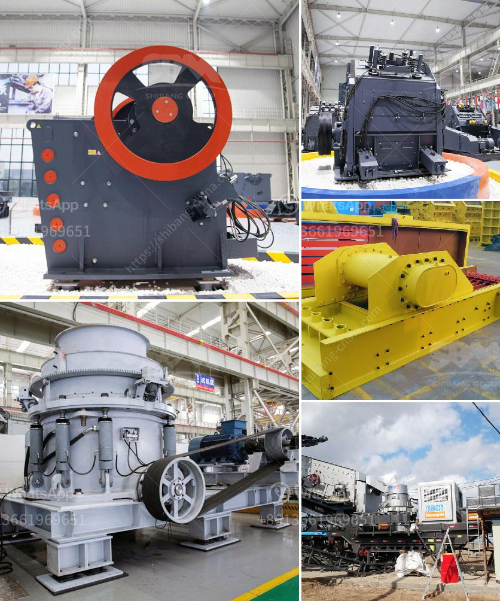

<h3>roller mill spaider</h3>
Roller mill spider is a critical component in the operation of roller mills, commonly used in the milling industry for grinding various materials. This article will delve into the importance of roller mill spiders and how they contribute to the efficiency and effectiveness of roller mills.

A roller mill spider, also known as a spider assembly, is positioned at the top of the vertical roller mill. It consists of a number of arms or vanes connected to a central hub. The main purpose of the spider is to support the grinding table and transmit the grinding forces to the foundation of the mill.

One of the key functions of the spider assembly is to distribute the grinding pressure evenly across the grinding table. As the material to be ground is fed onto the table, it is crushed and ground between the table and the grinding rollers. The spider ensures that the pressure is uniformly distributed, preventing localized high pressure areas that may cause material buildup, uneven grinding, or even damage to the mill.

In addition to pressure distribution, the roller mill spider also plays a crucial role in controlling airflow within the mill. During the grinding process, hot air is blown into the mill to dry the material and convey it to the classifier. The spider assembly acts as a guide for the airflow, ensuring that it is properly directed and circulated within the mill. This is important for efficient drying and conveying of the material, as well as maintaining proper temperature control.

Moreover, the spider assembly aids in the maintenance of the roller mill. It provides a stable support structure for the grinding table and rollers, allowing for easier inspection, maintenance, and replacement of worn-out components. This is particularly important as roller mills operate under harsh conditions and are subjected to continuous wear and tear.

The design and construction of the roller mill spider are critical factors in ensuring its durability and performance. It must be able to withstand the heavy grinding forces and vibrations produced during operation. Manufacturers carefully engineer spider assemblies using high-quality materials and employing robust design principles to guarantee their reliability and longevity.

In conclusion, the roller mill spider is an indispensable component in roller mills. Its primary functions include distributing grinding pressure evenly, controlling airflow, and supporting the grinding table and rollers. This ensures efficient grinding, proper drying, and reliable mill operation. The spider assembly also facilitates maintenance, allowing for easier inspection and replacement of components. Manufacturers meticulously design and construct spiders using durable materials and robust design principles. Roller mill spiders are essential for the smooth and efficient operation of roller mills in the milling industry.
<h3>Contact us</h3><ul><li><strong>Whatsapp:&nbsp;<a href="https://wa.me/8613661969651">+8613661969651</a></strong></li><li><a href="https://swt.shibang-china.com/?git&amp;zhl&amp;roller mill spaider"><strong>Online Service(chat now)</strong></a></li></ul><h3>Related</h3><ul><li><a href='mobile stone crushing machine for sale.md'>mobile stone crushing machine for sale</a></li><li><a href='crushing of calcined bauxite.md'>crushing of calcined bauxite</a></li><li><a href='mines de cobalt de cuivre de la zambie.md'>mines de cobalt de cuivre de la zambie</a></li><li><a href='small portable rock crusher for sale africa.md'>small portable rock crusher for sale africa</a></li><li><a href='mobile rock crushers in ghana.md'>mobile rock crushers in ghana</a></li></ul>