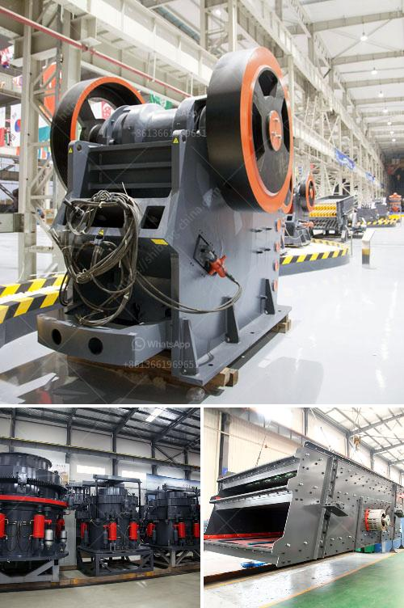

<h3>rolling ball mills manufacturer</h3>
Rolling ball mills are widely used in the industrial sector for the grinding and pulverizing of various materials. A rolling ball mill consists of a drum cylindrical shell, rotating on its axis, which is partially filled with grinding media such as balls. The materials to be ground are fed into the drum through an opening, and as the drum rotates, the grinding media crushes and grinds the materials, resulting in the desired product.

There are many manufacturers of rolling ball mills worldwide, providing a wide range of products and services. However, it is important to choose a reliable and reputable manufacturer to ensure the quality and efficiency of the equipment. With a plethora of options available, customers need to consider various factors when selecting a rolling ball mills manufacturer.

Firstly, the manufacturer's reputation and experience in the industry plays a crucial role. A manufacturer with a long-standing reputation and extensive experience is likely to have a better understanding of the market and its requirements. They would have developed a strong customer base and garnered trust by providing consistent quality products over the years.

Secondly, customers should consider the manufacturer's expertise and technological capabilities. Rolling ball mills are complex machines that require precise engineering and high-quality materials for optimal performance. Therefore, it is essential to choose a manufacturer that has a team of skilled engineers and technicians who can design and manufacture reliable and efficient rolling ball mills.

Furthermore, customers should evaluate the manufacturer's commitment to innovation and continuous improvement. In an ever-evolving industrial landscape, manufacturers need to keep up with the latest advancements and incorporate them into their products. A forward-thinking manufacturer will invest in research and development to enhance the performance, efficiency, and safety of their rolling ball mills.

Another crucial factor to consider is the manufacturer's after-sales service and support. The installation, maintenance, and troubleshooting of rolling ball mills can be complex tasks that require technical expertise. Therefore, choosing a manufacturer that provides comprehensive after-sales service and support is essential. This includes assistance with installation, training for the operators, and prompt response to any issues or queries that arise during the equipment's lifetime.

Finally, customers should compare the pricing and delivery terms offered by different manufacturers. While cost is an important consideration, it should not be the sole determining factor. It is crucial to strike a balance between cost-effectiveness and the quality and reliability of the equipment.

In conclusion, selecting a reputable and reliable rolling ball mills manufacturer is crucial for customers in the industrial sector. By considering factors such as reputation, expertise, innovation, after-sales service, and pricing, customers can make an informed decision and choose a manufacturer that best meets their requirements. Investing in high-quality rolling ball mills from a reliable manufacturer will result in improved productivity, quality, and efficiency in grinding and pulverizing various materials.
<h3>Contact us</h3><ul><li><strong>Whatsapp:&nbsp;<a href="https://wa.me/8613661969651">+8613661969651</a></strong></li><li><a href="https://swt.shibang-china.com/?git&amp;zhl&amp;rolling ball mills manufacturer"><strong>Online Service(chat now)</strong></a></li></ul><h3>Related</h3><ul><li><a href='coal mill pulverizer in thermal power plant.md'>coal mill pulverizer in thermal power plant</a></li><li><a href='equipment equipments used in gravel crushing.md'>equipment equipments used in gravel crushing</a></li><li><a href='coal crusher manufacturing machine.md'>coal crusher manufacturing machine</a></li><li><a href='closed quarrz plants in kenya.md'>closed quarrz plants in kenya</a></li><li><a href='list gold mining equipment and machines.md'>list gold mining equipment and machines</a></li></ul>