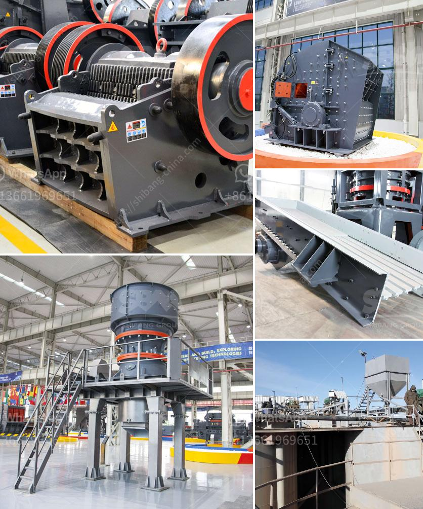

<h3>rotary kiln design calculation pdf</h3>
Rotary kilns are widely used for industrial processes such as cement production, thermal desorption of hazardous waste, and chemical reactions. These kilns typically operate at temperatures between 800-1400 degrees Celsius and require a consistent flow of heat to maintain efficient and reliable operation.

Designing a rotary kiln involves several factors that should be considered to ensure proper functioning and durability. One fundamental aspect is the kiln's thermal profile, which determines the temperature distribution within the kiln. This profile is essential for efficient heat transfer and chemical reactions.

To calculate the thermal profile, several parameters need to be considered, including the kiln's length, diameter, slope, rotation speed, and material properties. The length and diameter determine the kiln's capacity, while the slope impacts material flow. The rotation speed affects the residence time of materials inside the kiln, allowing for proper heat transfer and chemical reactions.

Another critical factor is the kiln's refractory lining, which protects the kiln from extreme temperatures and chemical reactions. The lining's thickness and composition need to be carefully considered to withstand the harsh environment and ensure the kiln's longevity.

Additionally, the kiln's mechanical design should take into account the weight and properties of the materials being processed, as well as the desired throughput. A proper balance needs to be achieved to prevent excessive mechanical stress and wear on the kiln's components.

In conclusion, the design of a rotary kiln requires meticulous calculations and considerations to ensure efficient and reliable operation. The thermal profile, refractory lining, and mechanical design are all crucial aspects that should be carefully evaluated. By paying attention to these factors, operators can achieve optimal performance and prolong the kiln's lifespan.
<h3>Contact us</h3><ul><li><strong>Whatsapp:&nbsp;<a href="https://wa.me/8613661969651">+8613661969651</a></strong></li><li><a href="https://swt.shibang-china.com/?git&amp;zhl&amp;rotary kiln design calculation pdf"><strong>Online Service(chat now)</strong></a></li></ul><h3>Related</h3><ul><li><a href='gold production process flow chart.md'>gold production process flow chart</a></li><li><a href='stone crusher with tractor.md'>stone crusher with tractor</a></li><li><a href='mobile crushing and screening plant for sale.md'>mobile crushing and screening plant for sale</a></li><li><a href='south africa gold processing equipment.md'>south africa gold processing equipment</a></li><li><a href='crusher equipment price.md'>crusher equipment price</a></li></ul>