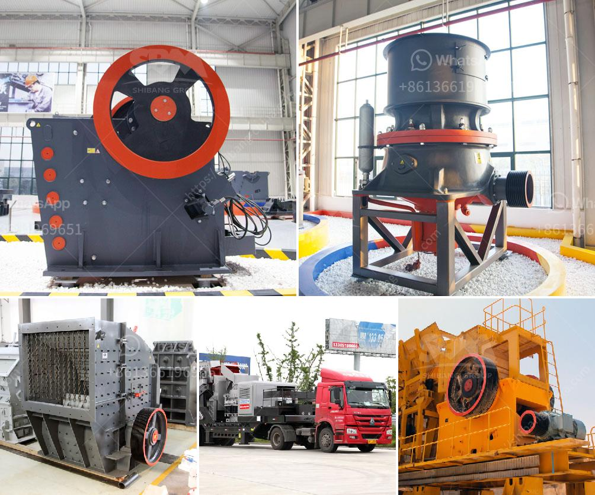

<h3>rotary kiln manufacturers</h3>
Rotary kilns have become an integral part of various industries, from cement manufacturing to waste management. These cylindrical vessels are used for high-temperature processing of materials, such as minerals, chemicals, and even organic wastes. An efficient and reliable rotary kiln is crucial for ensuring the smooth operation and productivity of these industries. This is where rotary kiln manufacturers play a critical role.

Rotary kiln manufacturers are companies that design, engineer, and manufacture these complex industrial machines. They cater to the diverse requirements of different industries and provide customized solutions for their specific needs. These manufacturers possess the expertise and technical know-how to produce high-quality rotary kilns that meet stringent standards of durability, efficiency, and environmental sustainability.

The demand for rotary kilns is rapidly growing due to the expanding industrial landscape and the need for sustainable production processes. The cement industry, for example, accounts for a significant portion of global greenhouse gas emissions. As a result, there is an increasing need for energy-efficient rotary kilns that can reduce carbon emissions and promote sustainable manufacturing practices.

Leading rotary kiln manufacturers are investing in research and development to develop innovative technologies that can optimize energy consumption and reduce environmental impact. For instance, some manufacturers are introducing advanced combustion systems and waste heat recovery mechanisms to maximize thermal efficiency and minimize fuel consumption. By incorporating these technologies, rotary kiln manufacturers are helping industries achieve their sustainability goals while ensuring efficient production processes.

Moreover, rotary kiln manufacturers are also focusing on improving the overall reliability and durability of their products. They utilize advanced engineering techniques and high-quality materials to manufacture robust rotary kilns that can withstand harsh operating conditions and guarantee uninterrupted production.

Customer satisfaction is the top priority for rotary kiln manufacturers. They work closely with clients to understand their specific needs and provide tailor-made solutions. Whether it is designing a kiln for a new project or retrofitting an existing one, these manufacturers offer comprehensive support throughout the entire lifecycle of the kiln, from installation and commissioning to maintenance and repair.

Collaboration with rotary kiln manufacturers is not limited to equipment supply. They also provide technical assistance, training programs, and after-sales services to ensure optimal performance and productivity. This close partnership between manufacturers and industries fosters knowledge sharing and mutual growth.

In conclusion, rotary kiln manufacturers are playing a pivotal role in driving sustainable industrial growth. Through continuous innovation, they are introducing cutting-edge technologies that promote energy efficiency and reduce environmental impact. By manufacturing reliable and high-quality rotary kilns, these companies are enabling industries to achieve their production targets while adhering to sustainability goals. With their expertise and customer-centric approach, rotary kiln manufacturers are not just providers of equipment but partners in sustainable development.
<h3>Contact us</h3><ul><li><strong>Whatsapp:&nbsp;<a href="https://wa.me/8613661969651">+8613661969651</a></strong></li><li><a href="https://swt.shibang-china.com/?git&amp;zhl&amp;rotary kiln manufacturers"><strong>Online Service(chat now)</strong></a></li></ul><h3>Related</h3><ul><li><a href='quarry equipment and crushers companies in japan.md'>quarry equipment and crushers companies in japan</a></li><li><a href='gravel jaw crusher.md'>gravel jaw crusher</a></li><li><a href='harga stone cruser bekas dijual.md'>harga stone cruser bekas dijual</a></li><li><a href='making gypsum powder mill.md'>making gypsum powder mill</a></li><li><a href='gold mining equipment plant for sales.md'>gold mining equipment plant for sales</a></li></ul>