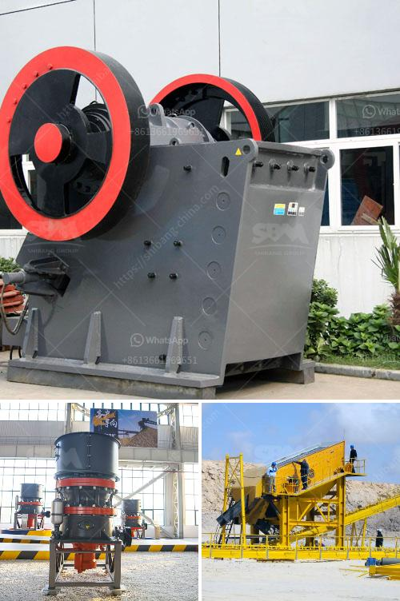

<h3>rotary kiln producers in indonesia</h3>
Rotary kiln producers in Indonesia have been playing a crucial role in the country's industrial development. As a rotary kiln is essential for various industrial processes, these producers have been delivering exceptional equipment that meets the demands of the Indonesian market.

Rotary kilns are cylindrical vessels that are widely used for thermal processing of materials such as cement, lime, and iron ore. They work by heating these materials to extremely high temperatures, which enables chemical reactions and other processes to take place. Due to their versatility and effectiveness, rotary kilns are used in a range of industries, including cement production, steel manufacturing, and waste management.

In Indonesia, the demand for rotary kilns has been steadily increasing due to the country's rapid industrialization and infrastructure development. With a population of over 270 million and a growing economy, there is a need for increased production of cement and other construction materials. Additionally, the country's rich natural resources, such as nickel and bauxite, require processing through rotary kilns for extraction and purification.

To cater to this demand, numerous rotary kiln producers in Indonesia have emerged. These producers specialize in designing, manufacturing, and supplying high-quality rotary kilns that are technologically advanced and energy-efficient. The equipment they produce adheres to international standards and has undergone rigorous testing to ensure its reliability and durability.

One prominent rotary kiln producer in Indonesia is PT PENTA CHEMICALS INDONESIA. With years of experience in the industry, they have established themselves as a reliable supplier of rotary kilns to various sectors. They offer customized solutions based on specific requirements and deliver end-to-end support, from design and engineering to installation and maintenance.

Another notable producer is PT Cipta Visi Sinar Kencana, which specializes in engineering and manufacturing rotary kilns for the cement industry. They have successfully supplied their equipment to numerous cement plants in Indonesia and have earned a reputation for their excellent design and reliable performance.

In addition to these producers, there are several other companies in Indonesia that contribute to the production of rotary kilns. They offer a range of rotary kiln designs to cater to different industries and applications. These producers understand the importance of efficient thermal processing and are continuously innovating to improve the performance and sustainability of their equipment.

The presence of these rotary kiln producers has not only helped meet the increasing demand in Indonesia but has also contributed to the country's economic growth. By providing high-quality equipment, they enable industries to operate efficiently and effectively, thereby boosting productivity and creating job opportunities.

In conclusion, rotary kiln producers in Indonesia play a crucial role in the country's industrial development. Their advanced and reliable equipment is essential for various industries, including cement production and mineral processing. These producers have not only met the growing demand for rotary kilns but have also contributed to the country's economic growth. With their continued focus on innovation and quality, they are poised to further strengthen Indonesia's industrial sector in the coming years.
<h3>Contact us</h3><ul><li><strong>Whatsapp:&nbsp;<a href="https://wa.me/8613661969651">+8613661969651</a></strong></li><li><a href="https://swt.shibang-china.com/?git&amp;zhl&amp;rotary kiln producers in indonesia"><strong>Online Service(chat now)</strong></a></li></ul><h3>Related</h3><ul><li><a href='crusher primary cone crusher.md'>crusher primary cone crusher</a></li><li><a href='mobile cone crusher for sale.md'>mobile cone crusher for sale</a></li><li><a href='prices for cheap roller mills in south africa.md'>prices for cheap roller mills in south africa</a></li><li><a href='uses jaw crusher in kenya.md'>uses jaw crusher in kenya</a></li><li><a href='gold recovery process flow diagram pdf.md'>gold recovery process flow diagram pdf</a></li></ul>