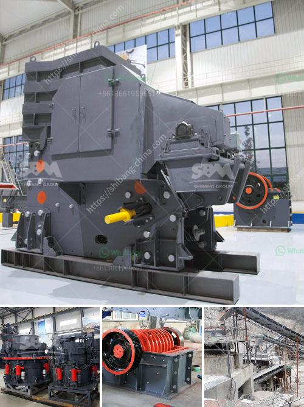

<h3>russia stone crusher</h3>
Stone crusher machine in Russia is mainly used for mining and processing crushed stones into small size and different mineral products. It can grind various stones and rocks into different sizes, such as gravel, rock dust, sand and so on.

The stone crusher machines are widely used in various fields, such as mining, construction, metallurgy, highways, chemistry, and railway industries. They are suitable for crushing different materials with different hardness levels. The crusher machines are also used in recycling industries, for the disposal of metal waste, construction waste, and other materials.

In Russia, stone crusher machine is mainly used for stone crushing operation with relatively low price. The stone crusher machines are widely applied in mining, metallurgy, construction, chemical industry, petrochemicals, transportation, energy, building materials industry, and other sectors. The market demand for crushing equipment is constantly growing due to the rapid development of the construction industry and the steady growth of infrastructure projects.

The stone crusher machines produced in Russia have been exported to many countries around the world, such as South Africa, North America, Southeast Asia, Eastern Europe, South America, Middle East and Africa, etc. Our products are highly recognized by our customers from all over the world and receive positive feedback due to their excellent performance, reliable quality and competitive price.

In conclusion, the stone crusher machine in Russia is suitable for a wide range of applications and can be used in various industries. It is an ideal choice for crushing operations with stones and rocks of different hardness levels. The stone crusher machines produced in Russia are highly praised by customers and have a broad market prospect.
<h3>Contact us</h3><ul><li><strong>Whatsapp:&nbsp;<a href="https://wa.me/8613661969651">+8613661969651</a></strong></li><li><a href="https://swt.shibang-china.com/?git&amp;zhl&amp;russia stone crusher"><strong>Online Service(chat now)</strong></a></li></ul><h3>Related</h3><ul><li><a href='used rock crushers for sale philippines.md'>used rock crushers for sale philippines</a></li><li><a href='prices for cheap roller mills in south africa.md'>prices for cheap roller mills in south africa</a></li><li><a href='crusher for ballast concrete.md'>crusher for ballast concrete</a></li><li><a href='kenya stone crusher usa.md'>kenya stone crusher usa</a></li><li><a href='cone crusher calculation.md'>cone crusher calculation</a></li></ul>