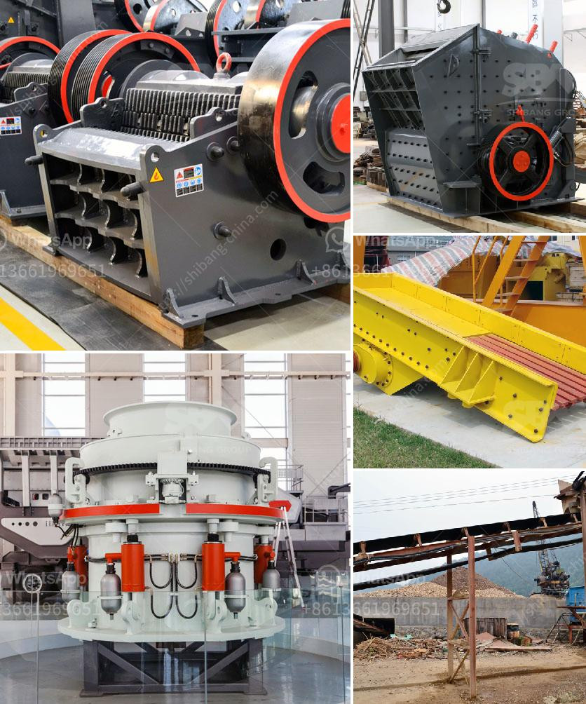

<h3>salcu powder washing machine</h3>
Doing laundry is an essential household chore that requires both time and effort. However, with the introduction of innovative washing machines, this tedious task has become much more convenient. Among these latest advancements, the Salcu Powder Washing Machine stands out as a game-changer in the world of laundry.

The Salcu Powder Washing Machine is a revolutionary appliance that offers a superior cleaning experience. Its cutting-edge technology combines the effectiveness of detergent and the convenience of a washing machine, providing exceptional results with every cycle. Here are some key features and benefits that make it a must-have household item:

1. Advanced Cleaning Power: The Salcu Powder Washing Machine is engineered with state-of-the-art technology that effectively removes even the toughest stains from your clothes. Its powerful motor agitates the water and detergent mixture, eliminating dirt, grime, and bacteria, leaving your laundry fresh and spotless. The machine's special design ensures thorough and consistent cleaning, regardless of load size or fabric type.

2. Cost-Effective: Using the Salcu Powder Washing Machine can significantly reduce the expenses associated with laundry. Unlike traditional washing machines that require a separate purchase of detergent, this innovative appliance utilizes Salcu powder technology, which is incorporated directly into the machine. With each cycle, the machine dispenses the precise amount of Salcu powder needed, eliminating the need for additional detergents and reducing overall laundry expenses.

3. Eco-Friendly: Salcu Powder Washing Machine takes sustainability seriously. By incorporating Salcu powder technology, this appliance reduces the use of single-use plastic detergent bottles, contributing to a greener environment. Salcu powder is made from biodegradable materials, ensuring that your laundry routine does not harm the planet.

4. Time-Saving: Traditional laundry routines often involve measuring and pouring detergent before each cycle, an inconvenient and time-consuming task. The Salcu Powder Washing Machine solves this problem effortlessly. With its innovative design, this appliance automatically dispenses the correct amount of Salcu powder for each load, saving you time and effort.

5. User-Friendly: The Salcu Powder Washing Machine is intuitively designed to ensure a hassle-free laundry experience. Its user-friendly control panel allows you to select the desired wash settings and adjust the cycle according to your needs. Additionally, it features a clear LED display that indicates the progress of the cycle, making it easy to monitor.

In conclusion, the Salcu Powder Washing Machine is a game-changer in the laundry industry. With its advanced cleaning power, cost-effectiveness, eco-friendliness, time-saving features, and user-friendly design, this appliance offers the ultimate solution for sparkling clean laundry. Investing in this innovative washing machine will not only simplify your laundry routine but also provide outstanding results, leaving your clothes fresh, clean, and ready to wear. Say goodbye to the hassle of traditional washing machines and embrace the future of laundry with the Salcu Powder Washing Machine.
<h3>Contact us</h3><ul><li><strong>Whatsapp:&nbsp;<a href="https://wa.me/8613661969651">+8613661969651</a></strong></li><li><a href="https://swt.shibang-china.com/?git&amp;zhl&amp;salcu powder washing machine"><strong>Online Service(chat now)</strong></a></li></ul><h3>Related</h3><ul><li><a href='gypsum ceiling plant price in pakistan.md'>gypsum ceiling plant price in pakistan</a></li><li><a href='flow chart gypsum production.md'>flow chart gypsum production</a></li><li><a href='concrete crushing companies in nigeria.md'>concrete crushing companies in nigeria</a></li><li><a href='how to setup a stone quarry.md'>how to setup a stone quarry</a></li><li><a href='grinding raymond dolomite.md'>grinding raymond dolomite</a></li></ul>