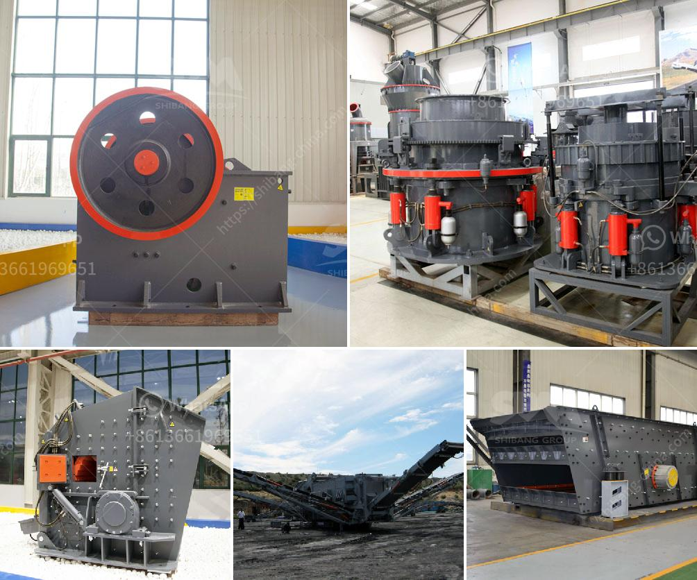

<h3>sale stone quarry crusher plant india</h3>
India is rich in mineral resources, with abundant reserves of limestone, coal, bauxite, iron ore, etc. There are a large number of stone quarries in India, which provide raw materials for various construction activities. The demand for stone quarry crusher plant is booming since mining industry develops rapidly in India. The nation’s infrastructure and architectural designs rely heavily on sand and aggregate, especially in the production of concrete. Quarrying and crushing activities are important aspects in construction projects to ensure the quality of materials used for various purposes.

The quarry crusher plant is a specialized production line aimed to produce building sand and stone, saving 50% energy compared to traditional sand making machine. The system is composed of a vibrating feeder, a jaw crusher, a cone crusher, a vibrating screen and belt conveyor. Compared to using individual stationary crushers, this quarry crusher plant is much more efficient and integrated. The perfect combination of screening and crushing technology not only makes the performance of this quarry crusher plant and screen outperforms the traditional, but also increases the output and decreases the energy consumption significantly.

In the past few years, India’s construction industry has been developed rapidly. The increased demand for sand and aggregate also stimulates the growth of quarry plants and stone crusher plants. More and more investors start to invest in the aggregate production industry now. Since the natural sand resource in India is limited, the manufactured sand market is in great demand and the sale of artificial sand production line is very popular in India. In order to meet the demands of the customers, the stone quarry crusher plant is extensive used in Indian stone mining site.

Thanks to the uninterrupted work of the entire line, the plant can perform well, ensuring the qualified final product of each customer. Compared to traditional stationary crushers, our quarry crusher plant is much more efficient and convenient. The installation of this plant is flexible and easy to maintain. It can be adjusted to different crushing cavity according to actual demands and also ensures the stable operation with overload protection system. 

In conclusion, the stone quarry crusher plant will be available for sale in India depending on the production capacity, whether single stage or double stage, are adaptable to different production requirements with quarry crusher plant for sale in India. It is with several benefits if you choose it, which greatly meets the production needs while lowering costs for customers.
<h3>Contact us</h3><ul><li><strong>Whatsapp:&nbsp;<a href="https://wa.me/8613661969651">+8613661969651</a></strong></li><li><a href="https://swt.shibang-china.com/?git&amp;zhl&amp;sale stone quarry crusher plant india"><strong>Online Service(chat now)</strong></a></li></ul><h3>Related</h3><ul><li><a href='suppliers kenya crusher.md'>suppliers kenya crusher</a></li><li><a href='kaolin processing equipment manufacturers in germany.md'>kaolin processing equipment manufacturers in germany</a></li><li><a href='grinding media loading in ball mill machine.md'>grinding media loading in ball mill machine</a></li><li><a href='gypsum ceiling plant price in pakistan.md'>gypsum ceiling plant price in pakistan</a></li><li><a href='basalt crusher supplier.md'>basalt crusher supplier</a></li></ul>