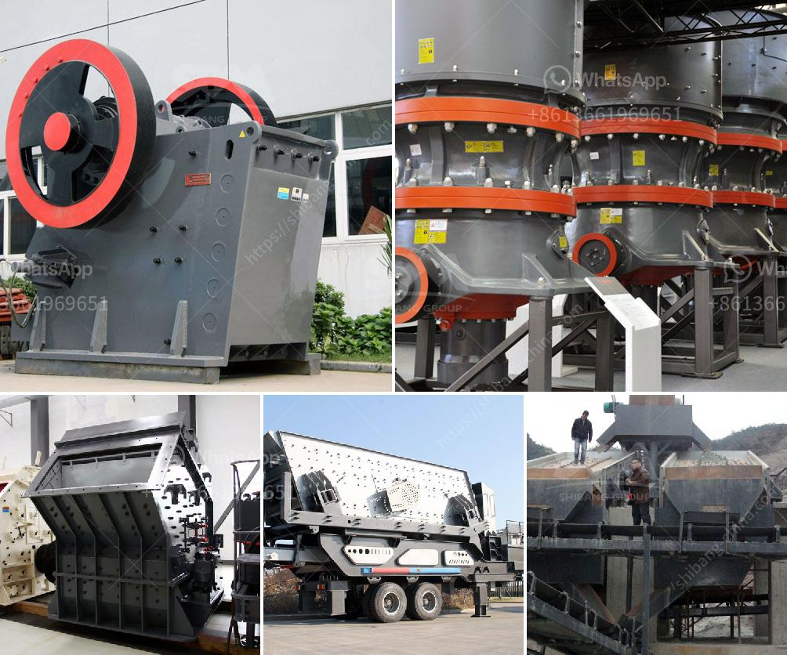

<h3>sales of conveyor belts</h3>
Conveyor belts play a vital role in various industries, facilitating the movement of materials and products from one point to another. With a multitude of applications spanning across manufacturing, mining, transportation, and more, the demand for conveyor belts has been steadily growing. In this article, we will delve into the sales trends of conveyor belts and explore the factors driving their popularity.

One of the key drivers behind the increasing sales of conveyor belts is their ability to enhance operational efficiency. In industries where large volumes of materials need to be transported regularly, conveyor belts provide a reliable and consistent method of moving goods. By automating the system, businesses can optimize their productivity and reduce manual labor, leading to cost savings and increased output. As more industries recognize the value of streamlining their operations, the demand for conveyor belts continues to rise.

Another factor contributing to the growing sales of conveyor belts is the emphasis on workplace safety. Conveyor belts are designed with safety features such as emergency stops, speed controls, and sensors to prevent accidents and protect workers. In industries where heavy or hazardous materials are handled, such as mining or construction, conveyor belts provide a safer alternative to manual handling. The increased focus on employee well-being has prompted businesses to invest in conveyor belts, ultimately driving their sales.

Moreover, conveyor belts offer versatility and adaptability to cater to various industries' unique requirements. Manufacturers now produce conveyor belts with different sizes, shapes, materials, and features to meet specific needs. For instance, industries handling bulk materials may opt for a heavy-duty conveyor belt with high load-bearing capacity, while industries dealing with fragile or sensitive products may require belts with cushioning or low-friction surfaces. This customization ability allows businesses to find the perfect match for their operations, resulting in increased sales.

Further fueling the sales growth of conveyor belts is the advancements in technology. Modern conveyor belts incorporate innovative features such as automation, IoT integration, and data analytics. These technologies enable businesses to monitor and control their conveyor systems in real-time, optimizing operations, and minimizing downtime. Additionally, intelligent conveyor belts equipped with sensors can detect faults or anomalies in the system, providing predictive maintenance alerts. The integration of such advanced technologies not only enhances efficiency but also offers valuable insights for process optimization, making conveyor belts an attractive investment for industries looking to stay competitive in the digital age.

Lastly, the global expansion of industries, particularly in emerging economies, has significantly contributed to the sales of conveyor belts. As developing countries experience rapid urbanization and industrialization, the demand for conveyor belts for sectors like mining, construction, and manufacturing has skyrocketed. This surge in demand has fueled investments in the conveyor belt industry, resulting in increased production and sales.

In conclusion, the sales of conveyor belts have been on an upward trajectory owing to their efficiency, safety features, versatility, technological advancements, and the global expansion of industries. As businesses continue to prioritize operational excellence and workplace safety, the demand for conveyor belts is expected to further rise. With ongoing research and development, it is likely that the conveyor belt industry will continue to evolve and adapt to meet the ever-changing needs of various sectors.
<h3>Contact us</h3><ul><li><strong>Whatsapp:&nbsp;<a href="https://wa.me/8613661969651">+8613661969651</a></strong></li><li><a href="https://swt.shibang-china.com/?git&amp;zhl&amp;sales of conveyor belts"><strong>Online Service(chat now)</strong></a></li></ul><h3>Related</h3><ul><li><a href='5kg grinding ball mill.md'>5kg grinding ball mill</a></li><li><a href='machinery for concrete crusher.md'>machinery for concrete crusher</a></li><li><a href='basalt fiber production lines.md'>basalt fiber production lines</a></li><li><a href='waived diamond mesh equipment south africa.md'>waived diamond mesh equipment south africa</a></li><li><a href='silica sand drying machine germany.md'>silica sand drying machine germany</a></li></ul>