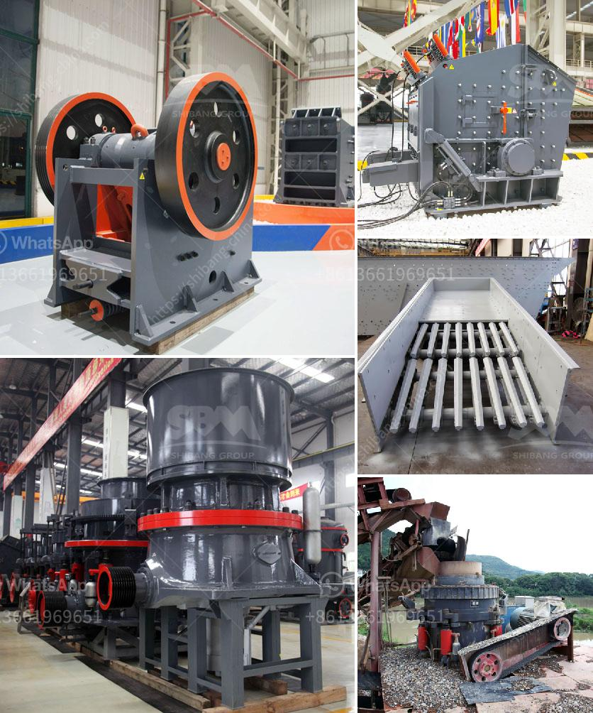

<h3>salt crusher machine pakistan</h3>
Pakistan is a country rich in natural resources, specifically, salt. With the rise of machinery and industrialization, mining and crushing of salt has become an integral part of the salt industry in Pakistan. Salt crushers are extremely important machinery used in the mining and crushing of salt. These machines help in the efficient removal of impurities from salt. Additionally, they eliminate the need for manual operation, resulting in a reduction in labor costs.

Salt crushing and grinding machines in Pakistan are necessary for industrial salt processing. In common, the salt crushing machine is a comparatively expensive piece of equipment to operate. It's primary advantage is the fact that it can crush and grind large chunks of rock salt into fine grains. This enables you to produce different types of salt, depending on your needs. You can use these salt for various purposes, such as cooking, salting roads, seasoning food, and industrial purposes.

The main machinery involved in the stone crushing industry is jaw crusher, impact crusher, cone crusher, hammer crusher, screening machine, belt conveyors etc. The crushing process is generally operated in three stages according to final materials uses, including primary crushing, secondary crushing and tertiary crushing. In stone crushing operation, the raw rock material will be in to the primary jaw crushers to make it further smaller in size as required by the customer. The crushed materials will be screened to separate the products in different sizes. The oversized materials will be further crushed by cone crusher or other types of crushing machine.

Crushing machinery manufacturers in Pakistan typically crush rock down to the desired size using jaw crushers. It is found that the rocks which contain more than 90% of salt can be crushed conveniently. Similarly, rocks are also crushed to make them suitable for use in road construction and concrete production. Concrete plants require a consistent, quality supply of raw materials, which can be achieved with the help of salt crusher machines.

The salt crusher machine is also widely used in various industries such as mineral processing, construction materials, chemicals, and cement industry, etc. Salt crushing machine is mainly used for the crushing process of various rocks and ores. The crushing effect is better when the material is crushed by the impact crusher, and the hammer crusher is used as the secondary crushing equipment. The wear of the impact crusher hammer only appears on the side facing the material. When the rotor speed is normal, the feed will fall to the surface of the hammer (the striking surface), and the back and sides of the hammer are not subject to wear.

In conclusion, salt crusher machine Pakistan plays an important role in the mining and construction industry. It is used for crushing and grinding salt rocks into small pieces for further processing. These machines are necessary for the overall processing of salt for various purposes. With improved technology, these machines have become more efficient and cost-effective, ultimately contributing to the growth of the salt industry in Pakistan.
<h3>Contact us</h3><ul><li><strong>Whatsapp:&nbsp;<a href="https://wa.me/8613661969651">+8613661969651</a></strong></li><li><a href="https://swt.shibang-china.com/?git&amp;zhl&amp;salt crusher machine pakistan"><strong>Online Service(chat now)</strong></a></li></ul><h3>Related</h3><ul><li><a href='description of a 5x6 jaw crusher.md'>description of a 5x6 jaw crusher</a></li><li><a href='gold mining equipment plant for sales.md'>gold mining equipment plant for sales</a></li><li><a href='rock crusher for excavator.md'>rock crusher for excavator</a></li><li><a href='output size of stone crusher machine.md'>output size of stone crusher machine</a></li><li><a href='basalt crusher supplier.md'>basalt crusher supplier</a></li></ul>