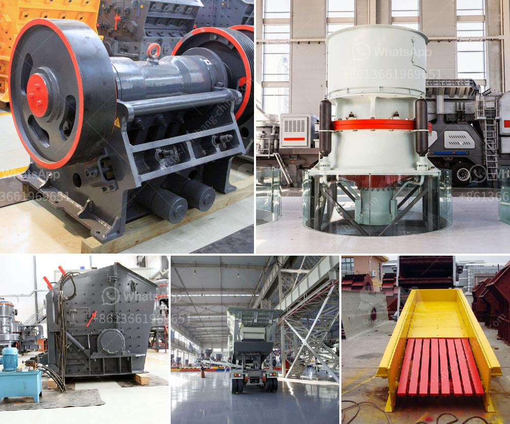

<h3>sample method statement stone crushing</h3>
The method of crushing stones in the standard manner is one of the most efficient ways of reducing the size of rocks and stones for various construction purposes. The method is widely used in road construction, infrastructure development, and building projects. This method statement provides a clear and systematic procedure for crushing stones using mechanical equipment and machinery.

The main objective of this method statement is to outline the procedure for crushing stones and ensure that safety measures are in place during the process.

This method statement applies to all personnel involved in the crushing process, including operators, supervisors, and maintenance personnel.

- Ensure that the crushing area is properly barricaded and access to unauthorized personnel is restricted.

- Conduct a pre-operational inspection of the crushing machine to ensure it is in good working condition.

- Wear appropriate personal protective equipment (PPE) including safety gloves, goggles, and protective clothing.

- Start the crushing machine and adjust the speed according to the desired size of the crushed stones.

- Regularly inspect the machine for any signs of malfunction and report the issue to the supervisor or maintenance personnel.

- Keep clear of the machine's moving parts and ensure that all guards and safety features are in place.

- Once the crushing process is complete, switch off the machine and unplug or isolate the power source.

- Perform a final inspection of the machine to ensure it is in good condition and ready for the next use.

In the event of an emergency, such as an accident or injury, follow the established emergency procedures and seek immediate medical attention if necessary. Ensure that all workers are aware of the emergency procedures and location of first aid kits.

In conclusion, stone crushing is an essential process in various construction projects. This method statement provides a step-by-step guide to safely and efficiently crush stones using mechanical equipment and machinery. By following the outlined procedure, workers can carry out this task in a safe and organized manner, minimizing the risk of accidents or injuries.
<h3>Contact us</h3><ul><li><strong>Whatsapp:&nbsp;<a href="https://wa.me/8613661969651">+8613661969651</a></strong></li><li><a href="https://swt.shibang-china.com/?git&amp;zhl&amp;sample method statement stone crushing"><strong>Online Service(chat now)</strong></a></li></ul><h3>Related</h3><ul><li><a href='dry process for gold recovery.md'>dry process for gold recovery</a></li><li><a href='mobile cone crushing station for sale.md'>mobile cone crushing station for sale</a></li><li><a href='small scale gold milling and processing plant.md'>small scale gold milling and processing plant</a></li><li><a href='famous stone crushing equipment supplier in china.md'>famous stone crushing equipment supplier in china</a></li><li><a href='550 used cone crusher for sale.md'>550 used cone crusher for sale</a></li></ul>