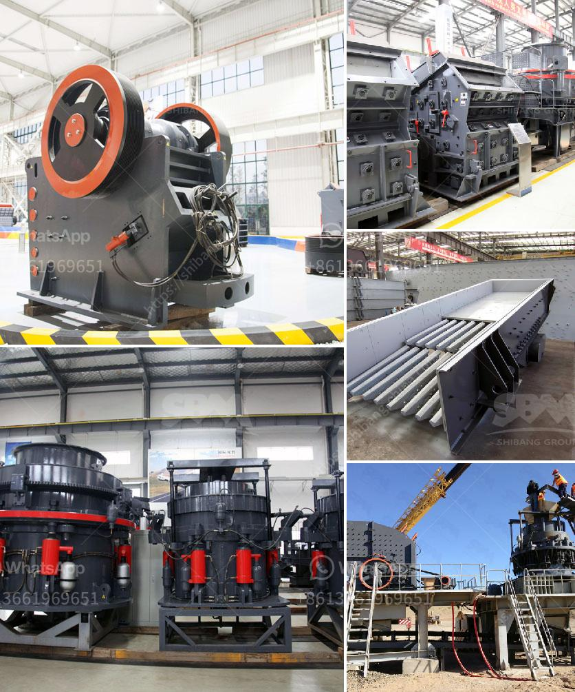

<h3>sand and gravel crushers machine</h3>
Sand and gravel crushers machine is designed to process different materials into different sizes for further processing. For sand and gravel production line, the process involves feeding the material into the crusher and then breaking down the stones and other debris into smaller pieces. Jaw crushers and gyratory crushers are commonly used equipment in mining and many other industries to handle various materials.

While choosing suitable crushers for sand and gravel production line, it is necessary to understand the advantages and disadvantages of different types of crushers. Their different working principles and structural characteristics determine the range of applicable materials and the production capacity of the equipment.

Jaw crushers are mainly used for primary crushing of various ores and large materials. They can crush the materials into medium-grained gravel. The performance of the machine is characterized by its large production capacity, high reliability, easy maintenance, and low operating cost. However, the jaw crusher is not suitable for crushing sticky materials or materials with a large moisture content as it will easily block the crushing chamber.

Gyratory crushers, on the other hand, are used for primary crushing of hard and abrasive rocks. Unlike jaw crushers, gyratory crushers operate at a higher speed and use pressure instead of impact to break down the materials. The machine also has a large feed size and can handle larger rocks compared to jaw crushers.

In addition to choosing the right crusher, there are other factors that can affect the production capacity of sand and gravel crushers machine. The humidity of the material and the size of the feed inlet can also affect the production capacity. It is recommended to perform a comprehensive analysis of the actual production needs and conditions before selecting the appropriate equipment.

Sand and gravel crushers machine play a key role in the production line and are indispensable equipment in sand and gravel production line. Under normal circumstances, the equipment has a good effect on the crushing of sand and gravel materials, but sometimes there will be problems due to improper use or maintenance. It is essential to maintain the equipment well in order to ensure the normal operation and prolong the service life of the machine.

Regular maintenance and repair are crucial to the efficient operation of sand and gravel crushers machine. For example, high-wear areas, such as hammers, rollers, and liners, need to be regularly checked and repaired. Regular lubrication is also necessary to ensure the smooth operation of the machine. Additionally, all safety mechanisms and controls must be in good working order to prevent accidents.

In conclusion, sand and gravel crushers machine can significantly improve the efficiency of the equipment in the production line. With the development of the construction industry, the demand for sand and gravel is increasing day by day. This paper introduces the common types of sand and gravel crushers, their working principles, applications, and production capacity. It also highlights the importance of regular maintenance to ensure the stable operation of the equipment. By choosing suitable crushers and optimizing the production process, it is possible to maximize the production capacity and realize the efficient operation of the sand and gravel production line.
<h3>Contact us</h3><ul><li><strong>Whatsapp:&nbsp;<a href="https://wa.me/8613661969651">+8613661969651</a></strong></li><li><a href="https://swt.shibang-china.com/?git&amp;zhl&amp;sand and gravel crushers machine"><strong>Online Service(chat now)</strong></a></li></ul><h3>Related</h3><ul><li><a href='mobile crushers south africa.md'>mobile crushers south africa</a></li><li><a href='hammer mill mining south africa.md'>hammer mill mining south africa</a></li><li><a href='granite quarrying process.md'>granite quarrying process</a></li><li><a href='limestone coal grinding machinery manufacture in india.md'>limestone coal grinding machinery manufacture in india</a></li><li><a href='gypsum chromium limestone mining.md'>gypsum chromium limestone mining</a></li></ul>