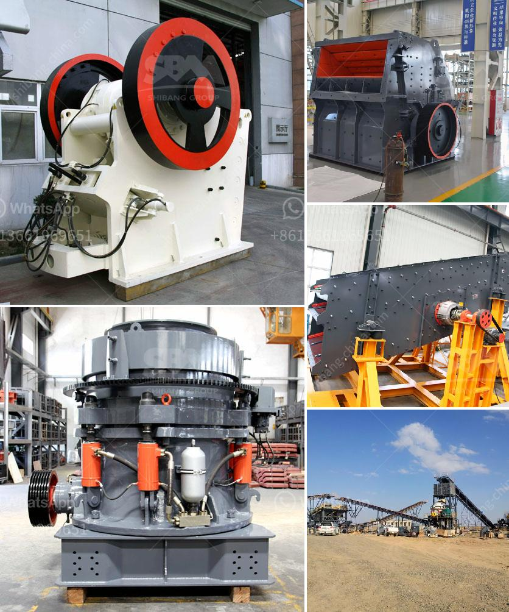

<h3>sand conveyor for sale</h3>
Industries such as construction, mining, and agriculture heavily rely on the transportation of materials like sand. These materials often need to be moved quickly and efficiently across sites, making sand conveyors a crucial piece of equipment. Sand conveyors streamline the process, enabling the effortless movement of large quantities of sand while significantly reducing manual labor. In this article, we will explore the benefits and features of sand conveyors for sale, emphasizing their value in various industries.

Sand conveyors revolutionize the transportation process by introducing automated systems that eliminate the need for manual labor. These conveyors leverage advanced technology to optimize performance and enhance efficiency. The automated mechanism allows sand to be moved continuously and evenly, reducing the possibility of spillage. The result is a significant reduction in transportation time and manpower requirements, enabling businesses to complete projects promptly and with greater precision.

The versatility of sand conveyors has contributed to their widespread adoption across diverse industries. Construction sites extensively utilize sand conveyors for various operations, including filling trenches, backfilling foundations, and leveling surfaces. These conveyors are also instrumental in mining operations, assisting in the excavation and transportation of sand and other aggregate materials. Moreover, in agricultural settings, these conveyors can be used for irrigation, soil fertilization, and landscaping projects, making them a valuable asset to farmers and landscaping companies alike.

The availability of sand conveyors for sale in various configurations ensures that businesses can find a model tailored to their specific requirements. The length, width, and height of the conveyor can be modified to accommodate different project needs. Additionally, conveyor belts can be designed with different textures and materials depending on the type of sand being transported. These customizable options enable businesses to invest in a conveyor system that optimizes their workflow and maximizes productivity.

Sand conveyors for sale are built to withstand the harsh conditions in which they operate. Constructed using high-quality materials, such as stainless steel and heavy-duty belts, these conveyors can handle the weight and abrasiveness of sand without wearing down quickly. The durability factor is crucial, as it minimizes downtime due to maintenance and replacement, allowing businesses to continuously operate without interruptions.

Sand conveyors prioritize safety for both operators and the environment. They often come equipped with emergency stop features, enabling operators to quickly halt the system in case of any mishaps. Additionally, advanced monitoring systems can detect and prevent blockages, reducing the risk of accidents and ensuring smooth operations. Furthermore, sand conveyors allow for precise control over the flow of sand, minimizing unnecessary spillage that could pose safety hazards on-site.

The availability of sand conveyors for sale has transformed the way industries handle sand transportation. With their enhanced efficiency, flexible applications, and customizable options, these conveyors play a crucial role in streamlining operations across multiple sectors. By investing in this equipment, businesses not only improve productivity but also ensure the safety of their operators and the environment. With rapid advancements in technology, sand conveyors are continuously evolving to cater to the ever-changing needs of the industry, making them an indispensable asset for businesses worldwide.
<h3>Contact us</h3><ul><li><strong>Whatsapp:&nbsp;<a href="https://wa.me/8613661969651">+8613661969651</a></strong></li><li><a href="https://swt.shibang-china.com/?git&amp;zhl&amp;sand conveyor for sale"><strong>Online Service(chat now)</strong></a></li></ul><h3>Related</h3><ul><li><a href='land available for stone quarry.md'>land available for stone quarry</a></li><li><a href='coal mill pulverizer in thermal power plant.md'>coal mill pulverizer in thermal power plant</a></li><li><a href='project cost to manufacture 200 tpd cement in in nepal.md'>project cost to manufacture 200 tpd cement in in nepal</a></li><li><a href='ball mill for cement.md'>ball mill for cement</a></li><li><a href='german made jaw crusher prices.md'>german made jaw crusher prices</a></li></ul>