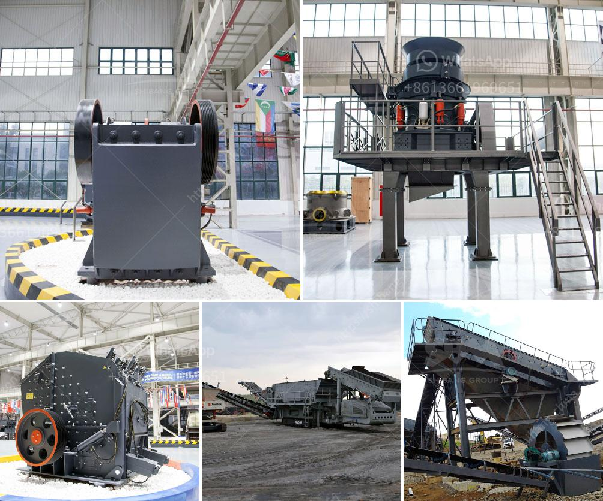

<h3>sand crusher machine manufacturers</h3>
Sand making machine, also known as vertical shaft impact crusher, is suitable for crushing soft or medium hard and extremely hard ore materials with hardness not higher than 320Pa. The sand making machine is widely used in large, smelting, building materials, highway, railway, water conservancy and chemical industry and many other sectors, which makes it the first choice of many manufacturers.

With the popularity of sand making machine, the sand crusher machine manufacturers have gained impressive achievements in the industry. Today, I will introduce three of the largest sand crusher machine manufacturers in the world.

Henan Hongxing Mining Machinery Co., Ltd. has established a strong foundation in technology research and development and has always been at the forefront of the industry. With decades of experience in research and development, production and sales, Hongxing has created a series of high-quality crushers, such as VSI sand making machine, mobile crushing plant, jaw crusher, cone crusher and so on. The machines are widely used in various industries, such as mining, construction, cement, water conservancy, metallurgy and chemical industries.

Zhengzhou Yifan Machinery Co., Ltd. is a professional sand maker manufacturer, focusing on the production of sand making machine for more than 20 years. With rich experience and advanced technology, Yifan has established a complete production system from design, production to sales, and provides customers with comprehensive and thoughtful services. Its sand making machine has the advantages of high output, low energy consumption, reliable operation and easy maintenance.

Shanghai Shibang Machinery Co., Ltd. has been deeply involved in the research and development of sand making machines for many years. Its sand crusher machines are well-known for their stable performance, excellent quality and affordable price. Shibang Machinery has a strong technical team to continuously explore and develop new crushing equipment to meet the changing market demands.

In conclusion, sand crusher machine manufacturers play a vital role in the production of high-quality sand. These manufacturers have a wide range of products to meet the different needs of customers. With their strong technical strength, advanced technology, and excellent after-sales service, the sand making machine manufacturers are continuously improving the overall quality and performance of sand making machines, contributing to the development of the industry and the society as a whole.
<h3>Contact us</h3><ul><li><strong>Whatsapp:&nbsp;<a href="https://wa.me/8613661969651">+8613661969651</a></strong></li><li><a href="https://swt.shibang-china.com/?git&amp;zhl&amp;sand crusher machine manufacturers"><strong>Online Service(chat now)</strong></a></li></ul><h3>Related</h3><ul><li><a href='alluvial gold washing machine manufacturer.md'>alluvial gold washing machine manufacturer</a></li><li><a href='how to start a cement factory.md'>how to start a cement factory</a></li><li><a href='mini mining crusher dealers.md'>mini mining crusher dealers</a></li><li><a href='bhel coal mill spares manufacturers.md'>bhel coal mill spares manufacturers</a></li><li><a href='new generation of hammer mill.md'>new generation of hammer mill</a></li></ul>