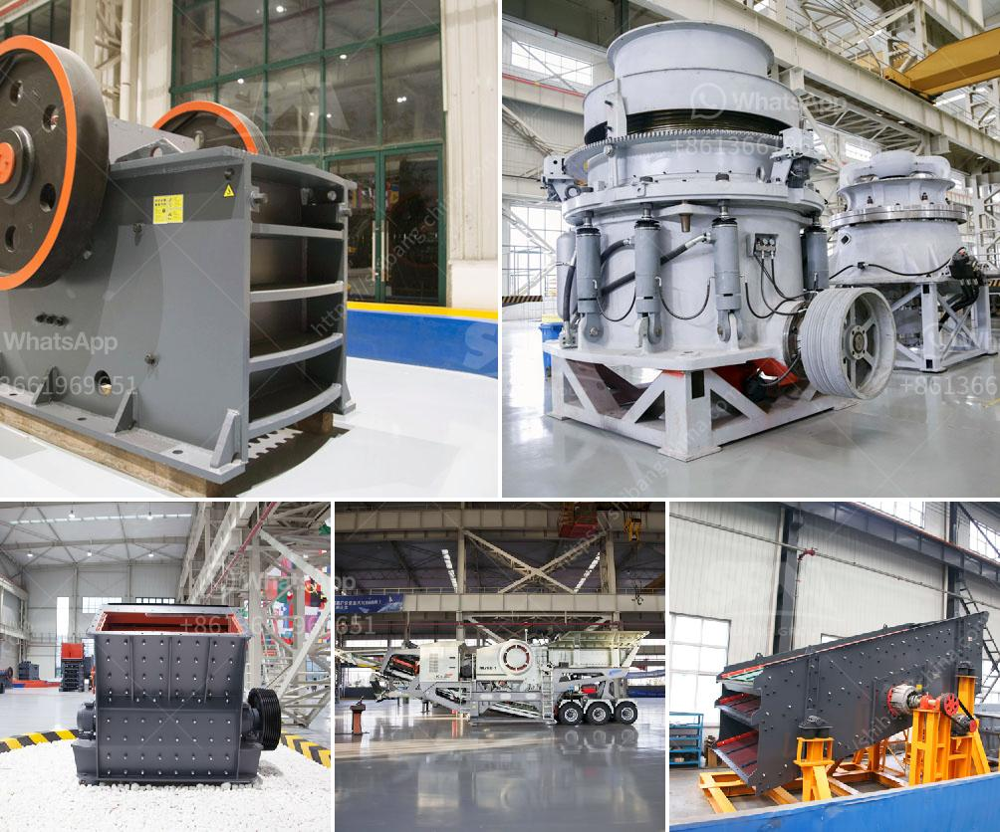

<h3>sand dust removal</h3>
Sand dust removal is a crucial process that plays a significant role in maintaining cleanliness and hygiene in various settings. Whether it is a construction site, a beach, or even a residential area affected by sandstorms, efficient sand dust removal is essential to ensure a safe and healthy environment for everyone.

Sand dust is composed of fine particles of sand that can be easily carried by the wind and dispersed over wide areas. It can not only create a nuisance but also lead to numerous health hazards. Breathing in sand dust can cause respiratory problems, allergic reactions, and even chronic lung diseases. Moreover, sand dust can settle on surfaces, making them gritty and difficult to clean.

In construction sites, sand dust is a common byproduct of various construction activities, such as cutting, grinding, or drilling. These processes generate large quantities of fine particles that, if left unchecked, can become a safety hazard and affect nearby communities. Efficient sand dust removal strategies are, therefore, necessary to prevent these particles from becoming airborne or spreading beyond the construction site.

One of the most widely used methods for sand dust removal is the implementation of effective dust control measures. These measures include the use of barriers, such as wind fences or screens, to reduce the movement of sand particles. Additionally, regular watering of exposed surfaces helps suppress dust by increasing their weight, preventing them from becoming airborne.

Vacuum systems equipped with high-efficiency particulate air (HEPA) filters are also effective in removing sand dust from the air. These filters are designed to capture even the smallest particles, ensuring clean and dust-free air. Vacuuming surfaces is another efficient way to eliminate settled sand dust, helping to maintain cleanliness and preventing further dispersion of particles.

In areas prone to sandstorms, such as desert regions, the focus shifts towards managing the aftermath of such events. Sandstorms can create massive amounts of sand dust, requiring extensive cleanup efforts. Sweeping and street cleaning machines equipped with powerful suction capabilities are commonly used for sand dust removal in these scenarios. These machines effectively collect the dislodged sand dust, preventing it from reentering the air or settling on surfaces.

Cleaning beaches, another crucial sand dust removal process, is essential for maintaining their natural beauty and protecting the health of visitors. Regular beach cleanups involve the removal of trash, but also extend to clearing sand dust. Specialized beach cleaning equipment, such as sifters or rakes, is used to collect and remove sand dust, ensuring a pleasant and safe experience for beachgoers.

In conclusion, effective sand dust removal is essential in various scenarios to ensure cleanliness, hygiene, and the well-being of individuals in affected areas. Implementing dust control measures, using vacuum systems, and utilizing specialized cleaning equipment all play vital roles in eliminating sand dust from the environment. By adopting these strategies, we can create a dust-free environment that promotes good health and enhances the quality of life for all.
<h3>Contact us</h3><ul><li><strong>Whatsapp:&nbsp;<a href="https://wa.me/8613661969651">+8613661969651</a></strong></li><li><a href="https://swt.shibang-china.com/?git&amp;zhl&amp;sand dust removal"><strong>Online Service(chat now)</strong></a></li></ul><h3>Related</h3><ul><li><a href='raymond hammer mill.md'>raymond hammer mill</a></li><li><a href='vibrating classifiing screen.md'>vibrating classifiing screen</a></li><li><a href='coal vertical roller mill.md'>coal vertical roller mill</a></li><li><a href='quartz crusher manufacturing process.md'>quartz crusher manufacturing process</a></li><li><a href='crusher plant saudi.md'>crusher plant saudi</a></li></ul>