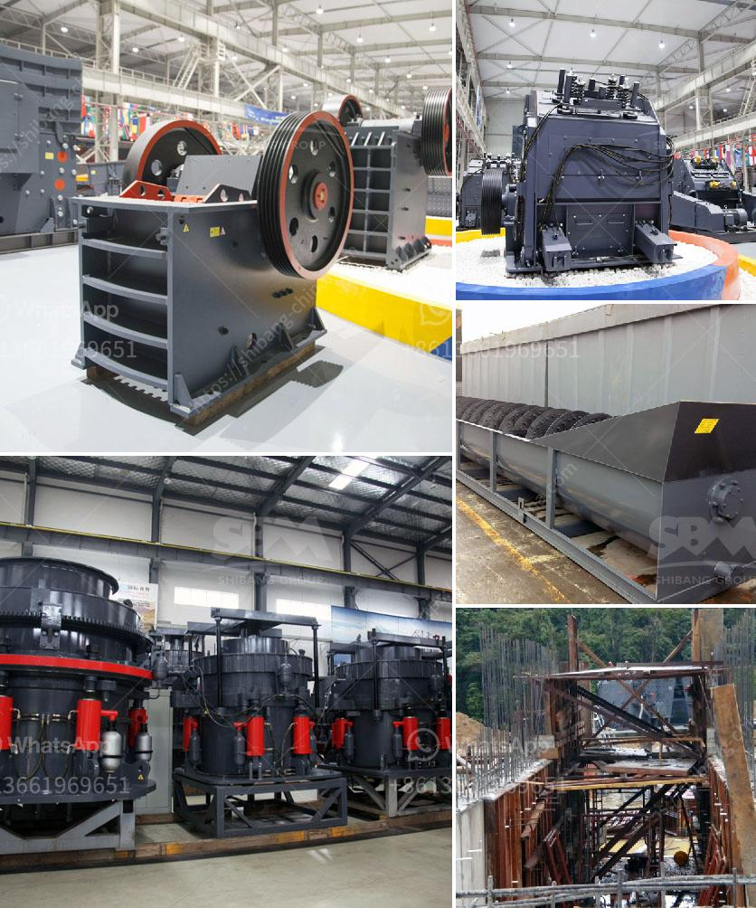

<h3>sand making machine crusher</h3>
Sand making machine, also known as vertical shaft impact crusher, is a crushing machine widely used in the quarrying and mining industries. The sand making machine has the characteristics of high crushing efficiency and fine crushing granularity.

In the production process of artificial sand, the sand making machine is particularly important. It can process large pieces of stones into sand with finer granularity, ensuring the uniformity and higher quality of the finished sand.

One of the key components of the sand making machine is the rotor, which plays a vital role in the crushing and shaping process of materials. The rotor is mainly composed of the spindle, disc, pin shaft, hammerhead, and other parts. The spindle is the main shaft of the sand making machine. It is connected with the motor through the V-belt, driving the rotor to rotate at high speed. The disc is fixed on the main shaft and plays a part in crushing the materials. The pin shaft is used for rotating the disc, and the hammerhead is fixed on the pin shaft.

The sand making machine crusher can be vertically or horizontally installed, and can also be tilted at a certain angle. Normally, the vertical installation is used for fine crushing, while the horizontal installation is used for medium and coarse crushing. The angle can be adjusted according to the specific needs of the production process.

The sand making machine crusher has a simple structure, high crushing efficiency, and low energy consumption. The operation and maintenance are convenient and the production cost is low. The finished sand has uniform particle size, smooth grain shape, and high compressive strength, which is widely used in construction, highway, railway, and other industries.

In addition to the advantages mentioned above, the sand making machine crusher also has some unique features. It adopts the advanced "stone-beating-stone" crushing principle, which greatly reduces the wear and tear of the equipment and prolongs the service life of the machine. The feed size of the machine is large, up to 80mm, which can effectively prevent the material from blocking the feed port.

Furthermore, the sand making machine crusher has high automation, making the operation more convenient and reducing labor costs. It is equipped with a hydraulic system for easy adjustment of the discharge port, which can effectively control the particle size of the finished product.

In conclusion, the sand making machine crusher is a powerful weapon in the production of artificial sand. With its excellent performance and unique characteristics, it can effectively crush and shape various materials, providing high-quality sand for the construction industry. As the demand for sand continues to increase, the sand making machine crusher will play an increasingly important role in the future.
<h3>Contact us</h3><ul><li><strong>Whatsapp:&nbsp;<a href="https://wa.me/8613661969651">+8613661969651</a></strong></li><li><a href="https://swt.shibang-china.com/?git&amp;zhl&amp;sand making machine crusher"><strong>Online Service(chat now)</strong></a></li></ul><h3>Related</h3><ul><li><a href='used grinding mill equipment.md'>used grinding mill equipment</a></li><li><a href='cornerstone equipment inc used rock crushers.md'>cornerstone equipment inc used rock crushers</a></li><li><a href='stone grinding mill.md'>stone grinding mill</a></li><li><a href='gravel jaw crusher.md'>gravel jaw crusher</a></li><li><a href='crusher machine for sale in pakistan.md'>crusher machine for sale in pakistan</a></li></ul>