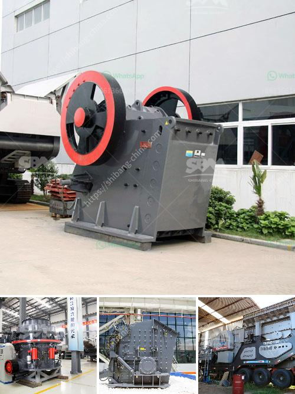

<h3>sand making machine equipment</h3>
Sand making machine, also known as vertical shaft impact crusher, is suitable for crushing soft or medium hard and extremely hard ore materials with hardness not higher than 320Pa. The sand making machine is widely used in large, smelting, building materials, highways, railways, water conservancy and chemical industries and other departments. 

The sand making machine equipment is made of high-quality materials, and its unique design concept combines traditional sand making equipment and modern technology. It has the advantages of reliable performance, convenient maintenance, energy saving, environmental protection, etc. It not only meets the requirements of various grain sizes and types of sand, but also has a wide range of applications. 

Firstly, the sand making machine equipment uses advanced crushing principle and production process, which ensures the good grain shape of finished products. It is especially suitable for artificial sand making and stone shaping. The sand making machine adopts a deep cavity impeller design, which can increase the throughput of materials and effectively improve the output. The wear-resistant and impact-resistant materials are used to improve the stability and long service life of the equipment.

Secondly, the sand making machine equipment is equipped with an automatic detection and oil lubrication system, which can greatly reduce the workload of daily maintenance and improve the production efficiency. The equipment has a unique dust-proof sealing system, which can effectively prevent the dust and impurities from entering the equipment, reduce the wear of components, and ensure the cleanliness and efficiency of the production environment.

Thirdly, the sand making machine equipment has a wide range of applications. It can not only produce high-quality sand and gravel aggregates used in infrastructure construction, but also be used for ore crushing and grinding operations in mining industry. It can crush various ores and rocks with different hardness and achieve the purpose of energy saving and emission reduction. 

In addition, the sand making machine equipment has the advantages of low noise, simple installation, easy operation and maintenance. It adopts the hydraulic device and thin oil lubrication system, which can automatically adjust the discharge port and control the oil temperature, so as to ensure the safe and stable operation of the equipment. 

In summary, the sand making machine equipment is an ideal choice for the construction of highways, railways, high-rise buildings, hydropower stations, airports and other projects. It has high efficiency and low consumption, and can meet the needs of different users for sand and stone production. With the continuous development of science and technology, the sand making machine equipment will have more advanced performance and broader application prospects in the future.
<h3>Contact us</h3><ul><li><strong>Whatsapp:&nbsp;<a href="https://wa.me/8613661969651">+8613661969651</a></strong></li><li><a href="https://swt.shibang-china.com/?git&amp;zhl&amp;sand making machine equipment"><strong>Online Service(chat now)</strong></a></li></ul><h3>Related</h3><ul><li><a href='mobile crusher track.md'>mobile crusher track</a></li><li><a href='jaw crusher supplier in the philippines.md'>jaw crusher supplier in the philippines</a></li><li><a href='coal pulverizer machine.md'>coal pulverizer machine</a></li><li><a href='small hammer crusher.md'>small hammer crusher</a></li><li><a href='mobile crusher in japan used crusher.md'>mobile crusher in japan used crusher</a></li></ul>