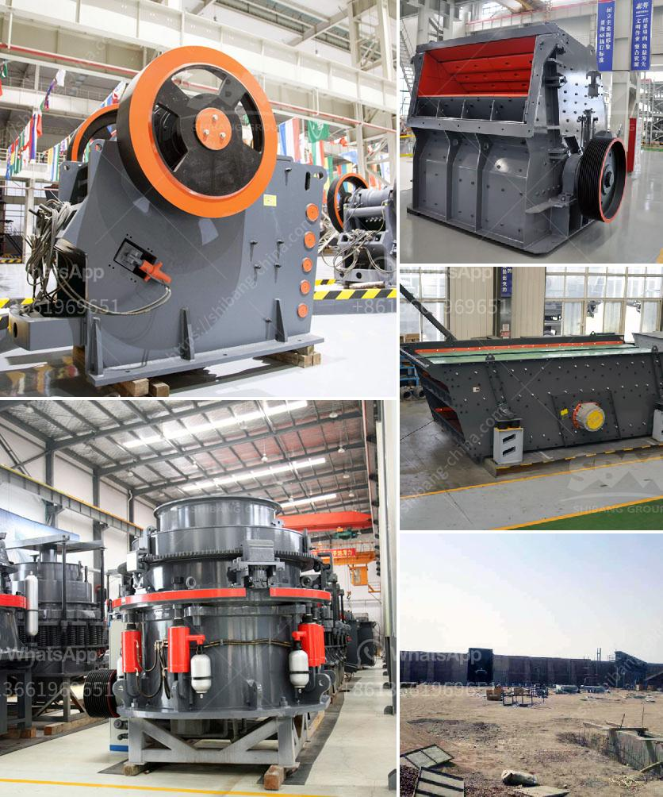

<h3>sand making production line</h3>
The development of infrastructure and urbanization has driven the demand for sand and gravel, creating a need for high-quality sand making production lines. These production lines have revolutionized the construction industry by allowing contractors to produce a large quantity of sand and gravel to meet the growing demand.

A sand making production line consists of a series of crushing and screening equipment. These machines work in tandem to transform raw materials such as rocks, limestone, and river stones into high-quality construction sand and gravel. The production process is as follows:

Firstly, large rocks are sent to a jaw crusher for primary crushing. The crushed rocks are then sent to a cone crusher or impact crusher for further crushing to achieve the desired particle size. The crushed materials are then sent to a vibrating screen to separate different sizes of sand and gravel.

The separated sand and gravel are then transported by belt conveyors to a sand making machine for shaping. The sand making machine uses the principle of "stone hitting stone" to break the materials and reshape them into cubic shape. The finished products are finally sent to a sand washer for cleaning and grading.

A well-designed sand making production line offers numerous advantages for the construction industry. Firstly, it ensures a stable and reliable supply of high-quality sand and gravel. Unlike natural sand, which may be limited in quantity and inconsistent in quality, manufactured sand produced by sand making machines can be controlled and standardized to meet specific construction requirements.

Secondly, a sand making production line greatly improves construction efficiency. With the ability to produce large quantities of sand and gravel, contractors can reduce their dependence on external suppliers, saving both time and costs. Additionally, consistent and high-quality materials minimize construction delays and rework, leading to more efficient project completion.

Moreover, a sand making production line promotes environmental sustainability. By utilizing rocks and other raw materials that are abundant and readily available, it reduces the need for excessive sand mining, which can have detrimental effects on river ecosystems. Additionally, the production process generates less dust and noise compared to traditional crushing methods, minimizing air and noise pollution.

Another advantage of a sand making production line is its adaptability to various construction projects. It can produce different sizes and shapes of sand and gravel to meet specific construction needs. From small residential building projects to large-scale infrastructure developments, a sand making production line can cater to diverse requirements.

In conclusion, the sand making production line has revolutionized the construction industry by providing a stable and reliable supply of high-quality sand and gravel. It improves construction efficiency, promotes environmental sustainability, and offers versatility for various construction projects. As the demand for sand and gravel continues to rise, investing in a sand making production line is a wise choice for contractors and developers to stay competitive in the ever-growing construction market.
<h3>Contact us</h3><ul><li><strong>Whatsapp:&nbsp;<a href="https://wa.me/8613661969651">+8613661969651</a></strong></li><li><a href="https://swt.shibang-china.com/?git&amp;zhl&amp;sand making production line"><strong>Online Service(chat now)</strong></a></li></ul><h3>Related</h3><ul><li><a href='calcium carbonate powder crushing crusher usa.md'>calcium carbonate powder crushing crusher usa</a></li><li><a href='silica sand crusher price in india.md'>silica sand crusher price in india</a></li><li><a href='gypsum router machines in uae.md'>gypsum router machines in uae</a></li><li><a href='machines for quarrying of stones.md'>machines for quarrying of stones</a></li><li><a href='jaw crusher plant for sale.md'>jaw crusher plant for sale</a></li></ul>