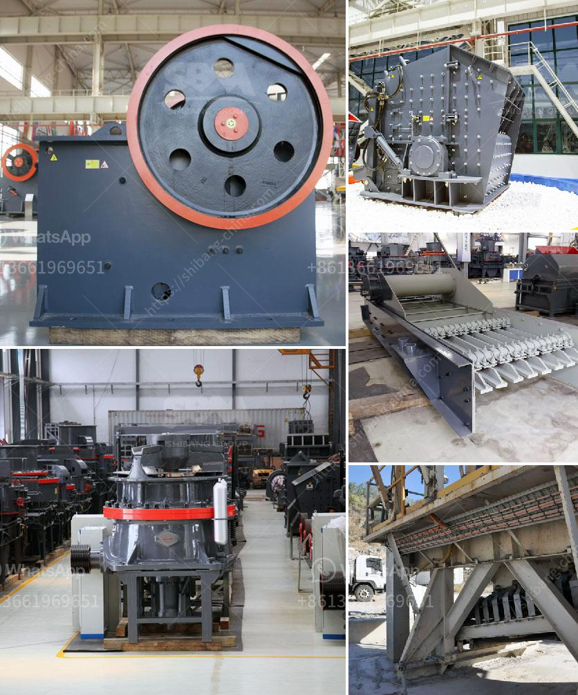

<h3>sand manufacturing machines china</h3>
Sand manufacturing machines, also known as sand making machines, are used for creating artificial sand by crushing rocks and stones. These machines are widely utilized in various sectors such as construction, mining, metallurgy, and highways. China, being one of the largest producers of construction materials, has a booming market for sand manufacturing machines.

There are several types of sand manufacturing machines available in China. One of the most common is the vertical shaft impact crusher, which uses crushing materials by utilizing the "stone-to-stone" principle. This machine has a simple structure and low operating costs, making it highly efficient for producing sand.

China is also known for its large-scale sand manufacturing machines, such as jaw crushers, cone crushers, and impact crushers. These machines can handle large quantities of materials and are widely used in the construction industry. With China's rapidly growing demand for infrastructure development, these machines are essential for producing high-quality sand used in road construction, bridges, and buildings.

In recent years, China has made significant advancements in technology, leading to the development of more advanced sand manufacturing machines. These machines incorporate features like automatic lubrication systems, adjustable discharge ports, and high crushing ratios, providing better productivity and efficiency. Additionally, they are equipped with advanced control systems to ensure stable operation and precise product sizes.

China's sand manufacturing machines are not only popular within the country but are also exported to many other countries around the world. Their competitive prices and reliable performance make them sought-after in the international market. These machines meet stringent quality standards and are often customized to suit specific client requirements.

The advent of sand manufacturing machines in China has revolutionized the construction industry, particularly in terms of efficiency and cost-effectiveness. These machines have significantly reduced the reliance on natural sand resources, which can be detrimental to the environment due to unsustainable mining practices. By producing artificial sand, China is able to meet the demand for construction materials while conserving natural resources.

However, it is essential to note that the production of artificial sand is not without its challenges. To ensure the quality of the final product, the raw materials used in the manufacturing process must be carefully selected. Additionally, the sand manufacturing machines need to be regularly maintained and inspected to prevent breakdowns and ensure continuous operation.

In conclusion, sand manufacturing machines in China play a crucial role in meeting the growing demand for construction materials. These machines are efficient, cost-effective, and help conserve natural resources by producing artificial sand. With China's technological advancements, these machines continue to improve in performance and are increasingly sought-after worldwide.
<h3>Contact us</h3><ul><li><strong>Whatsapp:&nbsp;<a href="https://wa.me/8613661969651">+8613661969651</a></strong></li><li><a href="https://swt.shibang-china.com/?git&amp;zhl&amp;sand manufacturing machines china"><strong>Online Service(chat now)</strong></a></li></ul><h3>Related</h3><ul><li><a href='price for stone crusher machine.md'>price for stone crusher machine</a></li><li><a href='iron slag crushing ball mill price.md'>iron slag crushing ball mill price</a></li><li><a href='small hammer crusher.md'>small hammer crusher</a></li><li><a href='lime stone crusher with capacity.md'>lime stone crusher with capacity</a></li><li><a href='capacity 70 130tph impact crusher.md'>capacity 70 130tph impact crusher</a></li></ul>