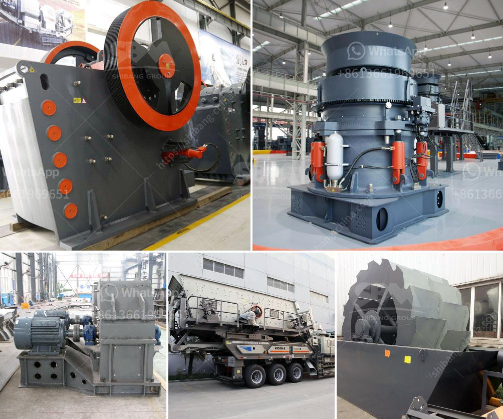

<h3>sand processing plant for sale</h3>
Sand is one of the most common and essential materials used in construction and various industrial applications. With the increasing demand for sand, the need for sand processing plants has skyrocketed. A sand processing plant is a facility that washes, separates, and sorts sand to produce valuable construction materials. In recent years, there has been a surge in the sale of sand processing plants as construction activities continue to grow worldwide.

Sand processing plants are designed to produce high-quality sand that meets the specific requirements of various industries. These plants typically consist of several components, including a feeder, crusher, screen, and washing equipment. The feeder is responsible for feeding the raw materials into the crusher for initial processing. The crusher breaks down large-sized rocks and stones into smaller pieces, which are then further processed.

The screen plays a crucial role in sand processing plants as it separates the sand into different sizes. This allows for the production of various grades of sand suitable for different applications. The washing equipment is responsible for removing impurities and excess moisture from the sand, resulting in a clean and high-quality end product.

Investing in a sand processing plant for sale can be highly beneficial for construction companies and other industries that require sand as a raw material. By having their own processing plant, companies can have a steady and reliable supply of sand, eliminating the need to rely on external suppliers. This ensures a cost-effective and uninterrupted production process.

Additionally, having a sand processing plant allows companies to have more control over the quality of the sand produced. They can customize the processing parameters to meet their specific requirements, ensuring that the sand satisfies the industry standards and regulations. This, in turn, enhances the reputation and reliability of the company, leading to increased customer satisfaction and business opportunities.

Furthermore, a sand processing plant for sale provides companies with the opportunity to generate additional revenue streams. They can sell the excess sand produced to other construction companies or industries that require sand. This diversification of income is an added advantage for businesses, allowing them to maximize their profitability.

When considering purchasing a sand processing plant, it is essential to choose a reputable and experienced manufacturer or supplier. The equipment should be of high quality and have a proven track record of efficiency and durability. Conducting thorough research, reading customer reviews, and seeking professional advice are crucial steps in making an informed decision.

In conclusion, a sand processing plant for sale offers numerous advantages for construction companies and industries that heavily rely on sand. It provides a steady and reliable supply of high-quality sand, allows for customization to meet specific requirements, and opens up additional revenue streams. Investing in a sand processing plant can be a game-changer for businesses looking to stay competitive in the ever-evolving construction industry.
<h3>Contact us</h3><ul><li><strong>Whatsapp:&nbsp;<a href="https://wa.me/8613661969651">+8613661969651</a></strong></li><li><a href="https://swt.shibang-china.com/?git&amp;zhl&amp;sand processing plant for sale"><strong>Online Service(chat now)</strong></a></li></ul><h3>Related</h3><ul><li><a href='portable screening and drying sand.md'>portable screening and drying sand</a></li><li><a href='grinding pigments for technology.md'>grinding pigments for technology</a></li><li><a href='ethiopia crusher jaw crusher.md'>ethiopia crusher jaw crusher</a></li><li><a href='aggregate crushers for sale.md'>aggregate crushers for sale</a></li><li><a href='crusher supplier china.md'>crusher supplier china</a></li></ul>