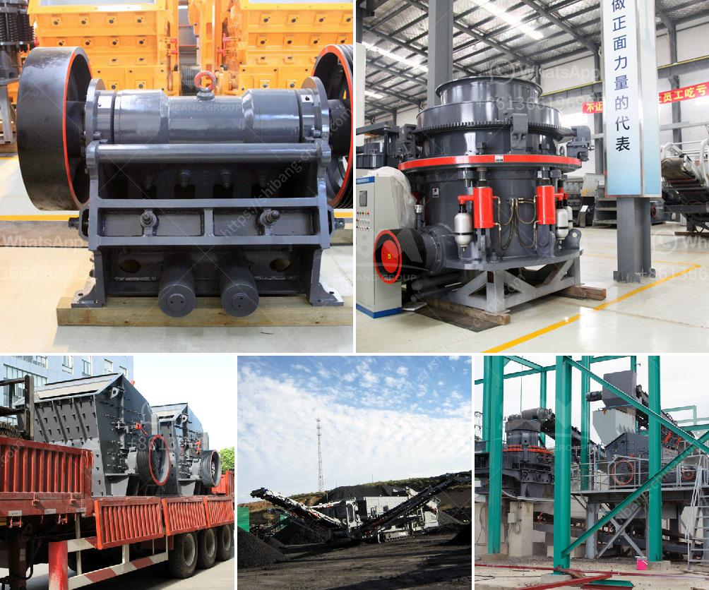

<h3>sand stone crusher</h3>
Sand stone is a type of sedimentary rock formed from sand-sized particles of various minerals such as quartz and feldspar. Sand stones are used for various construction purposes in the form of building blocks, bricks, tiles, and slabs. Sand stone crushing machines are essential for the construction industry as they produce the base materials required for building structures such as roads, bridges, and buildings.

Sand stone crushing machines are of two types: jaw crusher and impact crusher. These two types of crushers are widely used for crushing various materials in construction industry. Sand stone crushers are capable of crushing stones in various sizes, making it suitable for different construction activities such as road widening, building foundations, and landscaping.

Jaw crushers are the type of crushers commonly used in coarse crushing operations in the construction industry. It has a fixed jaw plate and a movable jaw plate. The movable jaw plate is hinged at the top and can swing in the opposite direction of the fixed jaw plate, allowing the material to be crushed between the two plates. This type of crusher is ideal for reducing large-sized stones into smaller sizes, making it easier to handle and transport.

Impact crushers, on the other hand, are used for primary and secondary crushing operations. They consist of a rotor that rotates at high speeds, and when the material enters the crushing chamber, it is subjected to the high-force impact of the rotating rotor. This impact breaks the material into smaller pieces, which are then discharged through the gap between the rotor and the impact plates. The crushed material can be further processed or used directly in construction activities.

Sand stone crusher machines are designed with various specifications to meet different crushing requirements. For example, jaw crushers are available in different feeding sizes and crushing capacities, while impact crushers have a wider range of adjustable discharge sizes and crushing capacities. These crushers can be operated manually or automatically depending on the application and desired output. They are equipped with various safety features to protect the operator and minimize accidents.

In the construction industry, sand stone crushers are commonly used for crushing rocks and stones into smaller sizes, which are used as raw materials for various construction activities. The demand for sand stone crushers is on the rise, especially in developing countries where infrastructure development is a priority. The availability of sand stone crushers with different specifications and crushing capacities allows construction companies to choose the most suitable machine for their specific requirements.

In conclusion, sand stone crushers play a crucial role in the construction industry by producing the base materials required for building structures. Jaw crushers and impact crushers are the two common types of crushers used for sand stone crushing. These machines are designed with various specifications to meet different crushing requirements. The increasing demand for sand stone crushers reflects the importance of this equipment in the construction industry and the need for reliable and efficient crushing solutions.
<h3>Contact us</h3><ul><li><strong>Whatsapp:&nbsp;<a href="https://wa.me/8613661969651">+8613661969651</a></strong></li><li><a href="https://swt.shibang-china.com/?git&amp;zhl&amp;sand stone crusher"><strong>Online Service(chat now)</strong></a></li></ul><h3>Related</h3><ul><li><a href='mobile crusher track.md'>mobile crusher track</a></li><li><a href='crusher price in oman.md'>crusher price in oman</a></li><li><a href='rock crusher alibaba.md'>rock crusher alibaba</a></li><li><a href='ultra fine grinder advantages.md'>ultra fine grinder advantages</a></li><li><a href='capacity 70 130tph impact crusher.md'>capacity 70 130tph impact crusher</a></li></ul>