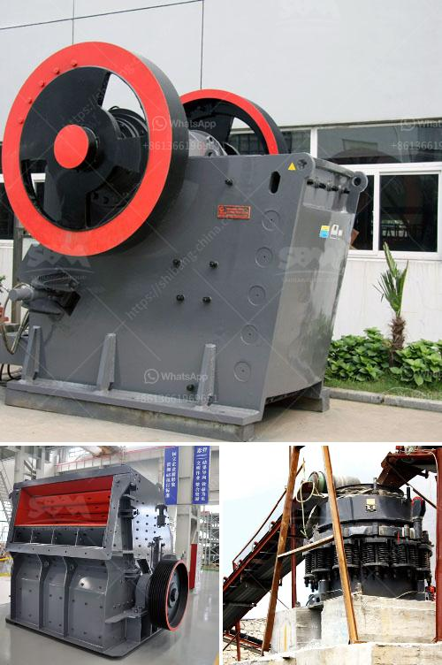

<h3>sand wash plants for sale in texas</h3>
Sand wash plants are an essential piece of equipment for any mining or construction operation. Designed to remove impurities and ensure the highest quality of sand, these wash plants are instrumental in producing high-quality sand products for a variety of applications. In Texas, where construction activities continue to boom, the demand for sand wash plants is on the rise. Thankfully, there are numerous options for sand wash plants for sale in Texas.

One of the key factors to consider while purchasing a sand wash plant is its efficiency and functionality. Look for plants that incorporate advanced washing technologies, such as cyclones, dewatering screens, and hydrocyclones, which help in effectively removing impurities and reduce water consumption. These features ensure that the washed sand has a low moisture content, making it suitable for immediate use or further processing.

Texas is known for its diverse geological formations, which often result in variations in sand quality and grading. When looking for a sand wash plant for sale in Texas, ensure that it has the flexibility to handle different types of sand. A plant capable of washing and classifying a wide range of sands, from coarse to fine, will allow you to meet various project requirements without compromising on quality.

It is also crucial to consider the plant's capacity, especially if you have large-scale projects or consistently high demand. Look for sand wash plants that offer customizable configurations, ensuring that you can easily scale up or down your operations as needed. Plants with high throughput capacity will allow you to efficiently process large volumes of sand and maintain an optimal production rate.

Lastly, reliability and durability are vital aspects to consider. Ensure that the sand wash plant you choose is built with robust materials and components, capable of withstanding the demanding conditions of the Texas environment. Look for reputable suppliers who provide excellent after-sales support, including maintenance, spare parts availability, and technical assistance.

In conclusion, with the ongoing growth in construction activities in Texas, the availability of sand wash plants for sale is crucial. By considering factors such as efficiency, flexibility, capacity, and reliability, you can find the perfect sand wash plant to cater to your specific needs and ensure high-quality sand production for your projects.
<h3>Contact us</h3><ul><li><strong>Whatsapp:&nbsp;<a href="https://wa.me/8613661969651">+8613661969651</a></strong></li><li><a href="https://swt.shibang-china.com/?git&amp;zhl&amp;sand wash plants for sale in texas"><strong>Online Service(chat now)</strong></a></li></ul><h3>Related</h3><ul><li><a href='hydraulic system vertical roller mill.md'>hydraulic system vertical roller mill</a></li><li><a href='impact crusher machine price.md'>impact crusher machine price</a></li><li><a href='kaolin crusher production costs.md'>kaolin crusher production costs</a></li><li><a href='stone crusher baler.md'>stone crusher baler</a></li><li><a href='zirconia powder ball mill plant.md'>zirconia powder ball mill plant</a></li></ul>