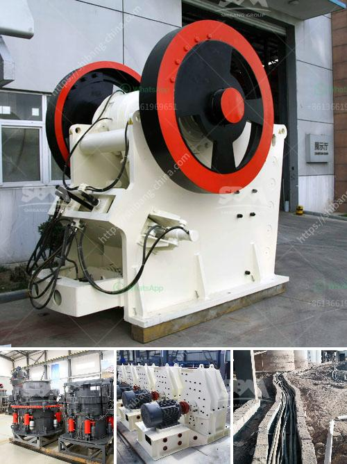

<h3>sand washing machine cost</h3>
Sand washing machine is a piece of equipment that is used to wash away sand or gravel applied in construction and other industries. It is widely used to gather gravel or sand particles for construction and concrete production purposes. With the high price of sand in the market, more and more investors are inclined to invest in a sand washing plant to get a higher profit.

The cost of sand washing machine is affected by different factors, such as the manufacturing process, materials, production capacity, energy consumption and operation and maintenance costs. As every user has different production requirements, when selecting the model of sand washer, it is necessary to refer to various aspects to ensure that the equipment is suitable for their own production line.

Firstly, the manufacturing process of sand washing machine will affect its cost. The machine that has more complex manufacturing process tends to have a higher price. Since sand washing machine manufacturers need to use advanced production technology and quality raw materials, the cost of sand washing machine will be higher.

Secondly, the production capacity of sand washing machine will also affect its cost. The equipment with higher production capacity usually has a higher price. Large-scale sand washing machines can handle a large amount of sand and gravel, so they generally have higher production costs.

Thirdly, energy consumption is an important factor to consider for the cost of sand washing machine. The equipment with high energy efficiency will help users save operating costs in the long run. Therefore, when purchasing a sand washer, it is important to consider its energy consumption level.

Lastly, the operation and maintenance costs of sand washing machine should not be ignored. Regular maintenance and inspection can greatly extend the service life of the equipment and reduce the cost of replacement parts. Therefore, it is necessary to choose a sand washer that is easy to operate and requires minimal maintenance.

In conclusion, the cost of sand washing machine depends on various factors such as the manufacturing process, production capacity, energy consumption and operation and maintenance costs. Therefore, before purchasing a sand washer, it is important to consider these factors and choose a suitable model that meets one's own production requirements. Investing in a high-quality sand washing machine can not only improve the production efficiency but also save operating costs in the long run.
<h3>Contact us</h3><ul><li><strong>Whatsapp:&nbsp;<a href="https://wa.me/8613661969651">+8613661969651</a></strong></li><li><a href="https://swt.shibang-china.com/?git&amp;zhl&amp;sand washing machine cost"><strong>Online Service(chat now)</strong></a></li></ul><h3>Related</h3><ul><li><a href='vertical roller mill manufacturers.md'>vertical roller mill manufacturers</a></li><li><a href='calcite costing of processing equipment.md'>calcite costing of processing equipment</a></li><li><a href='gold mining equipment south africa for sale.md'>gold mining equipment south africa for sale</a></li><li><a href='different crushed stones in nigeria.md'>different crushed stones in nigeria</a></li><li><a href='quarry crusher machines italy.md'>quarry crusher machines italy</a></li></ul>