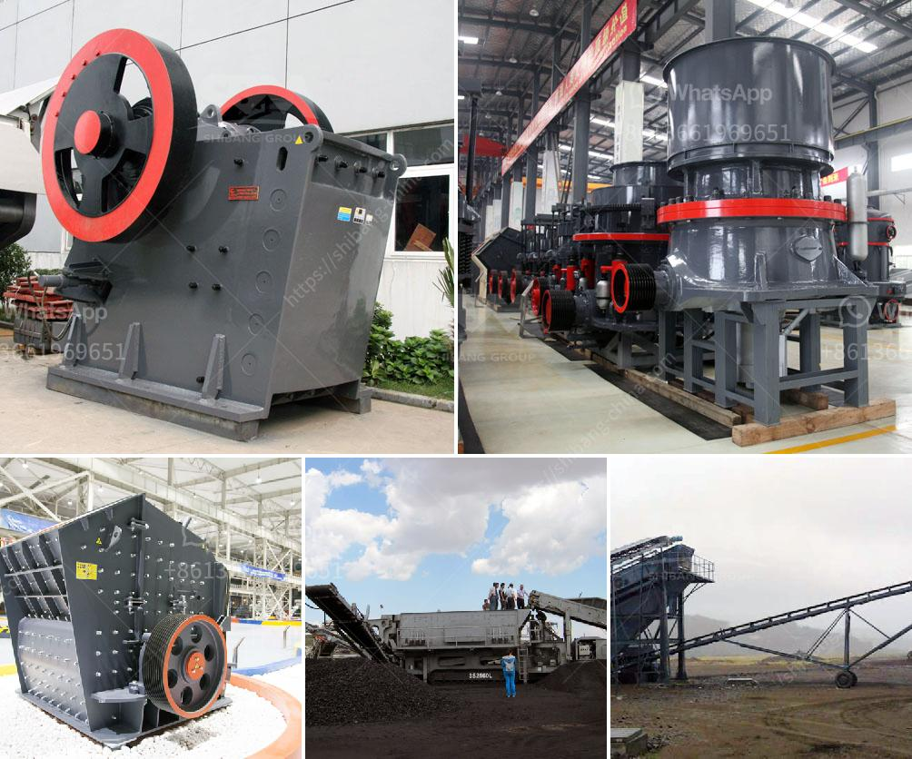

<h3>screen astec vibrating screen price</h3>
The Astec vibrating screen has emerged as a reliable and efficient device for industries dealing with aggregates and minerals processing. This innovative equipment has gained recognition due to its ability to accurately separate particles of various sizes, ensuring a higher-quality end product. In this article, we delve into the features and benefits of the Astec vibrating screen, shedding light on its competitive pricing and why it is a worthwhile investment.

First and foremost, the Astec vibrating screen is renowned for its robustness and durability. Constructed with high-quality materials and designed to withstand rigorous operating conditions, this equipment guarantees a long and productive lifespan, minimizing maintenance costs and downtime. Industries can rely on this solution to consistently deliver exceptional results, even in the harshest environments.

The Astec vibrating screen caters to a wide range of industrial applications, serving industries such as construction, mining, and recycling. Whether screening gravel, coal, ore, or other materials, this equipment ensures an efficient separation process. With customizable settings, it can adapt to specific particle sizes and deliver accurate sorting capabilities. Its versatility enables businesses to streamline operations and optimize material usage, resulting in improved productivity and cost-effectiveness.

The Astec vibrating screen incorporates cutting-edge technology to enhance screening efficiency. Thanks to its high-frequency linear vibration mechanism, it enables precise particle separation. This translates into faster processing times and increased throughput. By reducing the time and effort required to obtain the desired product, businesses can enhance their overall productivity and meet customer demands more effectively.

Astec places considerable emphasis on user experience and ergonomics when designing its vibrating screens. The user-friendly interface allows operators to easily control and monitor the screening process, ensuring optimal performance and minimal errors. Additionally, this equipment boasts a compact design, making it easy to integrate into existing production lines or mobile processing units. Its portability eliminates the need for extensive modifications, saving businesses both time and money.

Despite its advanced features and exceptional performance, the Astec vibrating screen is competitively priced. Astec Industries understands the importance of cost-efficient solutions, and their commitment to providing value for money is evident in their pricing strategy. Investing in this high-quality equipment offers a multitude of benefits to businesses, including improved efficiency, reduced maintenance costs, and increased customer satisfaction. Ultimately, the Astec vibrating screen proves to be a worthwhile investment that delivers long-term returns.

The Astec vibrating screen is an invaluable asset to industries seeking to enhance efficiency and productivity in their screening and sorting processes. From its durable construction to its versatile applications, this equipment offers a comprehensive solution to businesses across various sectors. Furthermore, its competitive pricing ensures that the Astec vibrating screen remains an accessible and cost-effective investment for both large corporations and small businesses alike. With its unparalleled performance and value, choosing the Astec vibrating screen is a decision that drives success and profitability in the long run.
<h3>Contact us</h3><ul><li><strong>Whatsapp:&nbsp;<a href="https://wa.me/8613661969651">+8613661969651</a></strong></li><li><a href="https://swt.shibang-china.com/?git&amp;zhl&amp;screen astec vibrating screen price"><strong>Online Service(chat now)</strong></a></li></ul><h3>Related</h3><ul><li><a href='100tph jaw crusher and ball mill.md'>100tph jaw crusher and ball mill</a></li><li><a href='mobile coal washing plant.md'>mobile coal washing plant</a></li><li><a href='crusher prices stone crusher primary and secondary.md'>crusher prices stone crusher primary and secondary</a></li><li><a href='kaolin processing equipment manufacturers in germany.md'>kaolin processing equipment manufacturers in germany</a></li><li><a href='rock gypsum buyers in china.md'>rock gypsum buyers in china</a></li></ul>