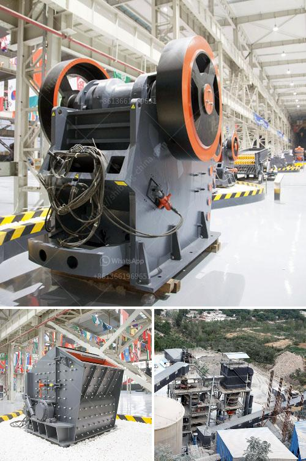

<h3>screen crusher for sale</h3>
A screen crusher is a versatile piece of equipment that is used to break down unwanted materials such as rocks, coal, and even concrete, into smaller pieces. It is commonly used in the mining and construction industries where it is utilized to reduce the size of raw materials for further processing. With the increasing demand for various construction materials, the need for screen crushers has also grown exponentially. Hence, the availability of screen crushers for sale has become crucial for companies in these industries.

One of the main advantages of using a screen crusher is its ability to efficiently and effectively process large volumes of materials. The various screens and crushers in the machine work together to break down the materials into smaller sizes, allowing companies to easily handle and transport them. Additionally, screen crushers offer great versatility, enabling operators to adjust the size of the output material according to their specific requirements.

Another key benefit of using a screen crusher is its cost-effectiveness. By breaking down materials into smaller sizes, companies can reduce their transportation and storage costs. Additionally, screen crushers can help recover valuable materials from waste, providing an opportunity to generate revenue. This makes screen crushers a vital investment for companies looking to maximize their profits while minimizing waste.

When considering a screen crusher for sale, there are several factors to take into account. Firstly, it is important to determine the specific needs of the company – the type of material and the desired output size. Companies should also consider the space available for installation and the power requirements of the machine. It is advisable to consult with a reputable supplier who can provide guidance and recommend the most suitable screen crusher for specific requirements.

In conclusion, a screen crusher is an essential piece of equipment in industries such as mining and construction. Its ability to efficiently process large volumes of materials and its cost-effectiveness make it a valuable investment. As the demand for construction materials continues to rise, the availability of screen crushers for sale becomes ever more important. By investing in a screen crusher, companies can enhance their operational efficiency, reduce costs, and maximize their profits.
<h3>Contact us</h3><ul><li><strong>Whatsapp:&nbsp;<a href="https://wa.me/8613661969651">+8613661969651</a></strong></li><li><a href="https://swt.shibang-china.com/?git&amp;zhl&amp;screen crusher for sale"><strong>Online Service(chat now)</strong></a></li></ul><h3>Related</h3><ul><li><a href='industrial rock crusher.md'>industrial rock crusher</a></li><li><a href='crusher stone manufacturers.md'>crusher stone manufacturers</a></li><li><a href='ball mill grinders cost.md'>ball mill grinders cost</a></li><li><a href='belt conveyor price.md'>belt conveyor price</a></li><li><a href='price list stone crusher german.md'>price list stone crusher german</a></li></ul>