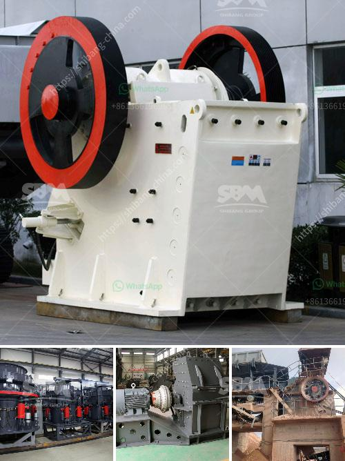

<h3>screening equipment mining vibrating screen for sale</h3>
Screening equipment is an integral part of any mining operation, whether it is for sale or used in the extraction of precious metals, minerals or other materials. The mining industry relies on screening devices to separate the valuable minerals from the gangue – containers that contain the desired minerals and the waste rock. These screening devices are vital to the mining process, as they ensure that the materials being extracted are of a specific size and quality.

One type of mining equipment that is commonly used is a vibrating screen. This machine is designed to separate the materials into different grades based on size. The vibrating screen consists of a vibrating motor, which makes the material move on the screen surface in a linear or circular motion. The screens are often made of polyurethane, stainless steel or other materials that are durable and can withstand the harsh conditions of the mining industry.

The mining vibrating screen has a variety of functions, such as removing large stones from the raw materials, classifying materials into different sizes and segregating the material for further processing. These machines are designed to withstand the rugged environments found in mining sites and utilize various screen media to achieve optimal screening efficiency. By using multiple layers of screen media, the vibrating screen can efficiently separate the materials without allowing too many fines to pass through.

When selecting a mining vibrating screen for sale, it is important to consider the materials that will be processed, the volume of materials to be processed, and the desired output. The size of the machine will also be a factor to consider, as it needs to fit into the available space at the mining site. Additionally, the machine should be easy to maintain and operate, as downtime can be costly in the mining industry.

There are many reputable companies that offer mining vibrating screens for sale. It is advisable to choose a manufacturer that has a proven track record in the industry and offers quality products and reliable after-sales service. It is also recommended to consult with experts in the field to ensure that the selected equipment is suitable for the specific mining operation.

In conclusion, screening equipment, specifically the mining vibrating screen, plays a vital role in the mining industry. It is responsible for separating the valuable minerals from the gangue, ensuring that the materials extracted are of a specific size and quality. When selecting a vibrating screen for sale, it is important to consider factors such as the materials to be processed, volume of materials, desired output, and the reputation of the manufacturer. By investing in a reliable and efficient vibrating screen, mining operations can achieve optimal screening performance, leading to increased productivity and profitability.
<h3>Contact us</h3><ul><li><strong>Whatsapp:&nbsp;<a href="https://wa.me/8613661969651">+8613661969651</a></strong></li><li><a href="https://swt.shibang-china.com/?git&amp;zhl&amp;screening equipment mining vibrating screen for sale"><strong>Online Service(chat now)</strong></a></li></ul><h3>Related</h3><ul><li><a href='mobile crusher hire in uae.md'>mobile crusher hire in uae</a></li><li><a href='ball mill media suppliers.md'>ball mill media suppliers</a></li><li><a href='stone crusher plant cost saudi.md'>stone crusher plant cost saudi</a></li><li><a href='vibratory screen south africa.md'>vibratory screen south africa</a></li><li><a href='crusher size 1 ton capacity hour.md'>crusher size 1 ton capacity hour</a></li></ul>