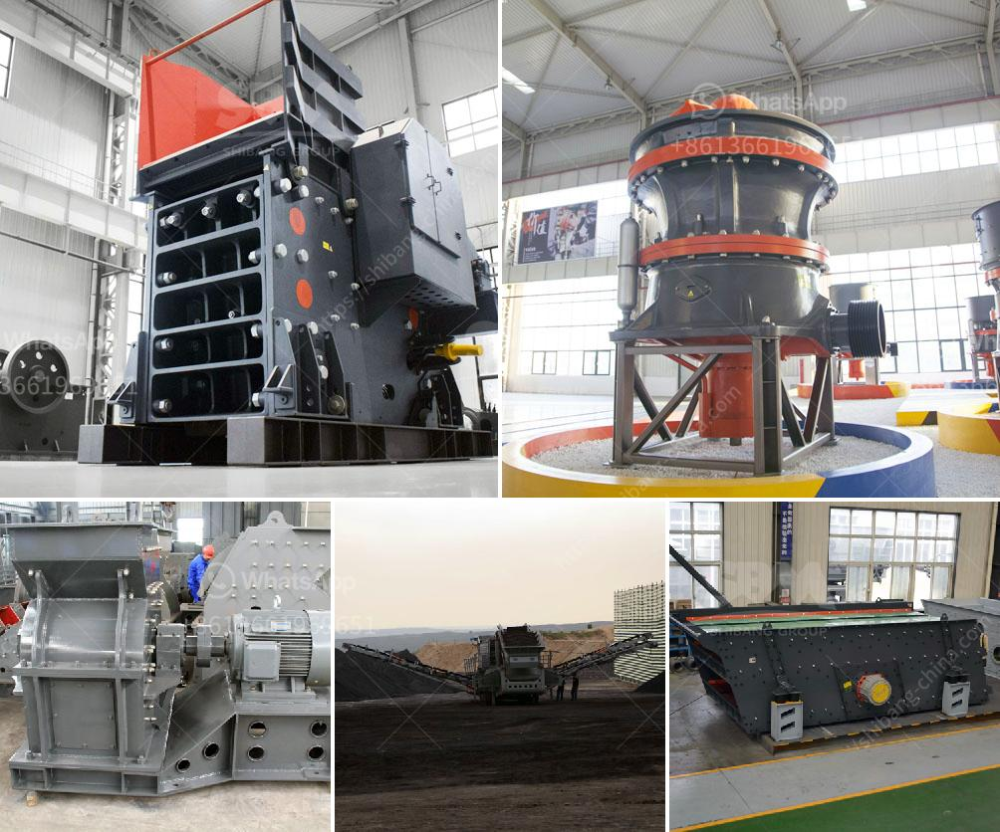

<h3>screens vibrating screens mobile</h3>
In today's fast-paced world, where productivity and efficiency are key, mobile vibrating screens have emerged as a game-changer for the screening industry. These portable screening solutions offer enhanced flexibility and versatility, making them a preferred choice for multiple industries. With their compact form factor and advanced technology, mobile vibrating screens are capable of efficiently processing various materials on the go, providing businesses with improved productivity, cost-savings, and a competitive edge.

One of the biggest advantages of mobile vibrating screens is their versatility. These screens can be easily transported to different locations, making them ideal for construction sites, mining operations, recycling facilities, and more. Whether it's gravel, sand, ores, or other materials, mobile vibrating screens can efficiently sort, classify, and separate them, enhancing the overall productivity of operations. Moreover, these screens can be quickly adjusted to meet different production requirements, ensuring maximum efficiency across a variety of applications.

Mobile vibrating screens utilize advanced vibration technology to efficiently separate and sort materials. The vibrating motion of the screen deck helps to break down larger particles, allowing for better screening of the desired material. This results in reduced downtime, increased throughput, and optimal screening efficiency. By eliminating oversized material and maximizing the yield of desired product, mobile vibrating screens enhance overall productivity and profitability. Additionally, the seamless integration of the screen with other mobile equipment like crushers or conveyors further streamlines the screening process, saving time and labor costs.

Mobile vibrating screens offer significant cost-saving benefits for businesses. Their portability eliminates the need for expensive and time-consuming transportation of material to a stationary screening facility. Moreover, the efficient screening process reduces power consumption and extends the lifespan of machinery. The ability to adjust the screen settings on the go minimizes material wastage, ensuring that only the desired product reaches downstream processes. Not only does this optimize resource utilization, but it also reduces operational costs associated with additional crushing, grinding, or other processing steps.

In summary, mobile vibrating screens have emerged as a revolutionary solution for businesses seeking enhanced efficiency and productivity in screening operations. Their versatility, portability, and advanced technology enable the sorting and classification of various materials while on the move, eliminating the need for stationary screening facilities. By improving screening efficiency and reducing material wastage, mobile vibrating screens offer significant cost savings and support sustainable business practices. As industries strive for greater productivity and streamlined processes, the adoption of mobile vibrating screens is becoming increasingly widespread, paving the way for a more efficient and cost-effective future.
<h3>Contact us</h3><ul><li><strong>Whatsapp:&nbsp;<a href="https://wa.me/8613661969651">+8613661969651</a></strong></li><li><a href="https://swt.shibang-china.com/?git&amp;zhl&amp;screens vibrating screens mobile"><strong>Online Service(chat now)</strong></a></li></ul><h3>Related</h3><ul><li><a href='jaw crusher and impact crusher made in japan.md'>jaw crusher and impact crusher made in japan</a></li><li><a href='kaolin processing plant.md'>kaolin processing plant</a></li><li><a href='hammer crusher taiwan.md'>hammer crusher taiwan</a></li><li><a href='small impact gold mill australia.md'>small impact gold mill australia</a></li><li><a href='process chart of sand washing plant.md'>process chart of sand washing plant</a></li></ul>