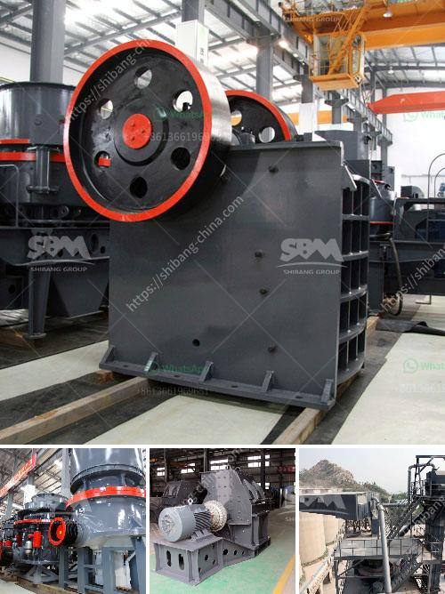

<h3>second hand jaw crushers in holland</h3>
Second-hand jaw crushers in Holland are an excellent choice when buying used machinery. With its reliability and performance, second-hand jaw crushers are capable of helping to reduce waste by recycling and repurposing materials. As the Netherlands is known for its progressive approach towards sustainability, second-hand jaw crushers are readily available and widely used in the country.

One of the key advantages of purchasing second-hand jaw crushers in Holland is the opportunity to select machines that fit specific needs. These crushers come in various sizes, making it possible to find one that suits different projects and applications. Additionally, the availability of different brands and models allows buyers to choose machines from reputable manufacturers with a proven track record of quality and durability.

Second-hand jaw crushers in Holland are generally well-maintained. Prior to sale, they undergo thorough inspection and maintenance to ensure they are in optimal condition. This means that buyers can have confidence in the performance and reliability of these machines. Moreover, many sellers provide detailed information about the history and usage of the crushers, enabling buyers to make informed decisions.

Purchasing second-hand equipment is also an environmentally friendly choice. By opting to buy used jaw crushers instead of new ones, buyers are reducing the demand for new resources and contributing to the circular economy. Recycling and reusing machinery not only saves money but also helps to conserve natural resources and reduce carbon emissions associated with manufacturing new equipment.

In conclusion, second-hand jaw crushers in Holland are a wise investment for those in need of crushing equipment. With a range of sizes and options available, buyers can find machines that meet their specific requirements. The ready availability of used crushers, along with their well-maintained condition, ensures peace of mind for buyers. Moreover, opting for second-hand crushers contributes to the sustainability goals of the Netherlands, making it an environmentally friendly choice.
<h3>Contact us</h3><ul><li><strong>Whatsapp:&nbsp;<a href="https://wa.me/8613661969651">+8613661969651</a></strong></li><li><a href="https://swt.shibang-china.com/?git&amp;zhl&amp;second hand jaw crushers in holland"><strong>Online Service(chat now)</strong></a></li></ul><h3>Related</h3><ul><li><a href='central shaft for stone crusher.md'>central shaft for stone crusher</a></li><li><a href='second hand stone crushing plants india.md'>second hand stone crushing plants india</a></li><li><a href='primary crusher meaning in hindi.md'>primary crusher meaning in hindi</a></li><li><a href='quarry crusher in zambia.md'>quarry crusher in zambia</a></li><li><a href='used crusher for sale kenya.md'>used crusher for sale kenya</a></li></ul>