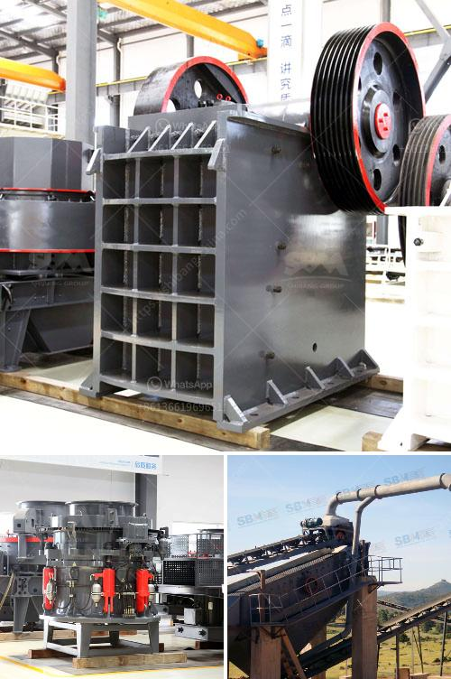

<h3>second hand quarry crusher machinery price in india</h3>
Second-hand quarry machinery price in India is relatively low, as they are heavily discounted and in good condition. Secondly, users of the machinery may have little to no use for it and instead want to sell it off, making it available at a much lower cost compared to new equipment.

In the quarrying industry, quarry crushers are the most commonly used pieces of equipment. They are essential for breaking down large rocks into smaller, more manageable sizes for further processing. With the high demand for these crushers, the market for second-hand quarry machinery in India is quite significant.

One of the main factors contributing to the lower price of second-hand quarry machinery in India is the overall lower cost of living. Labour costs in India are generally lower compared to other countries, which extends to the prices of machinery. Additionally, India has a large number of quarry sites, leading to a surplus of used equipment available for sale. This surplus creates a buyer's market, allowing potential buyers to negotiate for lower prices.

Another key factor affecting the price of second-hand quarry machinery in India is the condition of the equipment. Many sellers are keen to sell their machinery, especially those who have upgraded to newer models or have no further use for them. Thus, they may be willing to lower their prices to attract buyers. However, it is essential for potential buyers to thoroughly inspect the machinery before purchasing to ensure it is in good working condition.

The specific price range for second-hand quarry machinery in India can vary depending on various factors such as the age of the equipment, its usage, and the brand. On average, the price range can be anywhere from a few thousand dollars to tens of thousands of dollars. Buyers should assess their needs and budget to determine the appropriate price range for them.

When purchasing second-hand quarry machinery in India, it is crucial to consider the long-term benefits. While the initial cost may be lower, it is essential to evaluate the potential maintenance and repair costs that may arise. Buyers should also assess the machinery's capacity and performance to ensure it meets their specific requirements. Additionally, it is advisable to research the reputation and credibility of the seller to ensure a smooth transaction and quality product.

In conclusion, the second-hand quarry machinery market in India offers buyers the opportunity to acquire reliable equipment at a significantly lower price compared to new machinery. The surplus availability, lower labor costs, and sellers' willingness to sell contribute to the affordability of these machines. However, buyers must carefully evaluate the condition, performance, and long-term costs of the machinery before making a purchase. With proper research and due diligence, acquiring second-hand quarry machinery in India can be a cost-effective solution for quarrying businesses.
<h3>Contact us</h3><ul><li><strong>Whatsapp:&nbsp;<a href="https://wa.me/8613661969651">+8613661969651</a></strong></li><li><a href="https://swt.shibang-china.com/?git&amp;zhl&amp;second hand quarry crusher machinery price in india"><strong>Online Service(chat now)</strong></a></li></ul><h3>Related</h3><ul><li><a href='denver roll crusher for sale.md'>denver roll crusher for sale</a></li><li><a href='ball mill ball mill factories.md'>ball mill ball mill factories</a></li><li><a href='rock crusher zenith.md'>rock crusher zenith</a></li><li><a href='ultrafine pulverizer.md'>ultrafine pulverizer</a></li><li><a href='zirconia powder ball mill plant.md'>zirconia powder ball mill plant</a></li></ul>