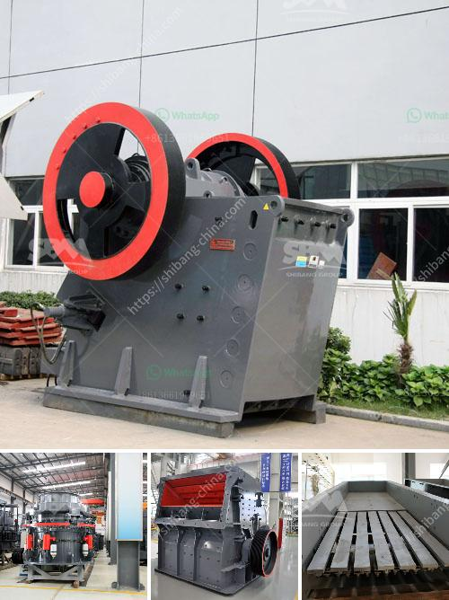

<h3>second hand raymond mill in india</h3>
Second-hand Raymond mills are extensively used in the field of industrial engineering and offer incredible cost savings for companies who want to cut down on their expenditure. With a wide range of models available, these mills are generally known for their durability and reliability. In India, the market for second-hand Raymond mills remains strong as companies heavily rely on this equipment for their daily operations.

The Raymond mill is a type of grinding machine that is widely used in various industries such as mining, building materials, chemical industry, and metallurgy. It has a tradition of reliable performance, stable operation, high efficiency, and long service life. With the continuous development of the industry, the demand for Raymond mills is also constantly increasing.

Buying a second-hand Raymond mill not only provides substantial financial benefits but also allows companies to acquire the equipment they need in a shorter period compared to buying new. Additionally, it helps in reducing the initial investment and maintenance costs. Many industrial plants prefer purchasing second-hand Raymond mills in India due to the availability of a wide range of models and designs.

However, it is essential for companies to carefully inspect and assess the condition of the second-hand Raymond mill before making a purchase. They should verify whether the mill has been maintained properly and if any essential components need to be replaced or repaired. Additionally, it is crucial to buy from reputable sellers or dealers who have a track record of trustworthy transactions.

Moreover, companies should consider their specific requirements and the type of materials they will be processing with the Raymond mill. This will help them in choosing the most suitable model with the necessary features and specifications.

In conclusion, the market for second-hand Raymond mills in India is thriving as companies aim to reduce costs without compromising on quality. These mills offer significant financial benefits and can be a valuable addition to any industrial setting. However, buyers should exercise caution and conduct thorough inspections before making a purchase to ensure they get the most appropriate equipment that meets their specific needs.
<h3>Contact us</h3><ul><li><strong>Whatsapp:&nbsp;<a href="https://wa.me/8613661969651">+8613661969651</a></strong></li><li><a href="https://swt.shibang-china.com/?git&amp;zhl&amp;second hand raymond mill in india"><strong>Online Service(chat now)</strong></a></li></ul><h3>Related</h3><ul><li><a href='puzolana 250 tph crusher.md'>puzolana 250 tph crusher</a></li><li><a href='mobile stone jaw crusher equipment.md'>mobile stone jaw crusher equipment</a></li><li><a href='cost of a mill of hammers.md'>cost of a mill of hammers</a></li><li><a href='ton per day crusher barmac.md'>ton per day crusher barmac</a></li><li><a href='mobile crusher in japan used crusher.md'>mobile crusher in japan used crusher</a></li></ul>