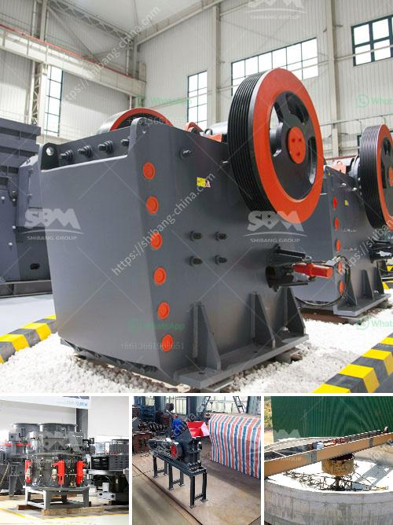

<h3>second hand stone crushing plants india</h3>
The stone crushing industry in India is witnessing a surge in demand for second hand stone crushing plants. Numerous factors, such as lack of new mining reserves, growing infrastructure and construction activities, have led to the increasing demand for second hand stone crushing plants. In addition, rising costs of raw materials and equipment, as well as stringent environmental regulations, are also driving more companies to seek affordable alternatives.

One of the main benefits of purchasing second hand stone crushing plants is the economic advantages. These plants are sold at a fraction of the cost of a brand-new plant, making them an attractive option for small and medium-sized enterprises (SMEs) and construction companies operating on tight budgets. By acquiring a second hand stone crushing plant, these businesses can save significantly on capital investment, which can then be diverted towards other aspects of their operations.

Furthermore, second hand stone crushing plants provide a quick and efficient solution to meet the growing demand for construction materials. As these plants are readily available and can be installed within a short period of time, construction companies can quickly start producing high-quality crushed stones to fulfill their project requirements. This not only saves time but also eliminates the need for lengthy approval processes associated with establishing new crushing plants.

Second hand stone crushing plants also offer environmental benefits. By recycling existing materials, such as concrete and asphalt, these plants minimize the need for extracting new raw materials from the earth. This helps to conserve natural resources and reduce the environmental impact associated with mining activities. Moreover, the use of second hand stone crushing plants promotes sustainability by preventing the disposal of these materials in landfills, leading to a reduction in waste generation.

Another advantage of second hand stone crushing plants is the flexibility they offer in terms of customization. Since these plants have already been used in previous projects, they can be easily modified or upgraded to meet specific production requirements. This adaptability allows companies to tailor their operations to suit the unique needs of different projects, thereby enhancing their overall efficiency and productivity.

However, it is crucial for buyers to conduct thorough inspections and assessments before purchasing second hand stone crushing plants. This ensures that the plants are in good working condition and have the necessary features and capabilities to meet the desired production output. Buyers should carefully examine the equipment, including the crushers, conveyor belts, screens, and other components, to ensure they are in proper working order and require minimal maintenance or repairs.

In conclusion, the demand for second hand stone crushing plants in India is on the rise due to various economic and environmental factors. These plants offer numerous benefits, including cost savings, quick installation, environmental sustainability, and customization options. However, buyers must exercise caution and conduct proper due diligence to ensure they acquire a reliable and efficient plant that meets their specific requirements. With proper research and inspection, second hand stone crushing plants can be a viable and affordable option for businesses in need of quality construction materials.
<h3>Contact us</h3><ul><li><strong>Whatsapp:&nbsp;<a href="https://wa.me/8613661969651">+8613661969651</a></strong></li><li><a href="https://swt.shibang-china.com/?git&amp;zhl&amp;second hand stone crushing plants india"><strong>Online Service(chat now)</strong></a></li></ul><h3>Related</h3><ul><li><a href='stones crushing into building sand.md'>stones crushing into building sand</a></li><li><a href='feldspar crusher for sale.md'>feldspar crusher for sale</a></li><li><a href='mobile crusher for hire in ghana.md'>mobile crusher for hire in ghana</a></li><li><a href='crusher machine for sale in pakistan.md'>crusher machine for sale in pakistan</a></li><li><a href='jaw crusher terminator.md'>jaw crusher terminator</a></li></ul>