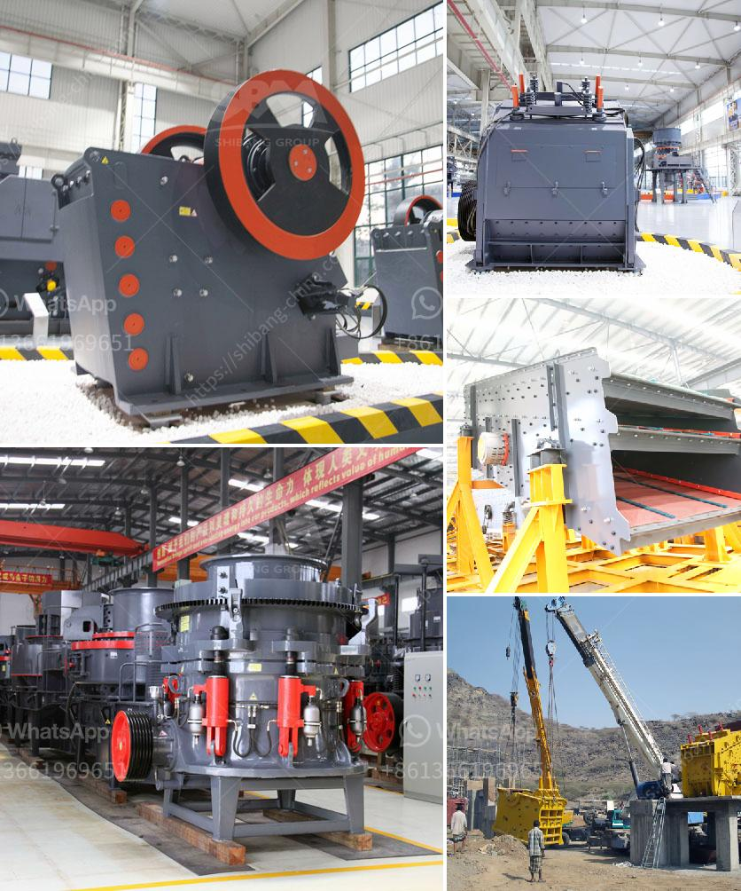

<h3>second hand vrm cement mill for sale</h3>
The cement industry is one of the largest and most important industries worldwide. It produces a product that is essential for our everyday lives, provides employment opportunities, and contributes to economic growth. However, producing cement comes with its own set of challenges. One such challenge is finding reliable equipment to handle the grinding and blending of the raw materials needed to produce cement.

For many cement producers, the vertical roller mill (VRM) is a preferred choice for grinding raw materials. It is efficient, reliable, and capable of producing a wide range of cement types. With the increasing demand for high-quality cement worldwide, the VRM cement mill is gaining popularity as the preferred cement grinding equipment.

However, investing in a new VRM cement mill can be quite expensive, especially for smaller cement producers. This is where second-hand VRM cement mills come into play. These mills, previously used in cement plants, are available at a fraction of the cost of a new mill. However, before making a purchase, it is important to carefully consider several factors.

Firstly, it is crucial to thoroughly inspect the mill to ensure it is in good working condition. Look for signs of wear and tear, such as cracks or excessive corrosion, which may lead to operational issues and costly repairs in the future. Consider hiring a professional engineer to examine the mill and provide a comprehensive evaluation.

Additionally, check whether the mill comes with any warranties or guarantees. Reputable sellers often offer some form of assurance, providing you with confidence in the mill's performance and longevity. Be cautious of sellers who refuse to offer any form of warranty or guarantee, as this may indicate potential issues with the mill.

Another important aspect to consider is the mill's capacity. Ensure that the capacity of the second-hand VRM cement mill aligns with your production requirements. It should be able to handle the desired workload efficiently and effectively, without causing any bottlenecks in the production process.

Furthermore, consider the mill's energy efficiency. Older mills may not be as energy-efficient as newer models, leading to increased operating costs in the long run. Be sure to compare the energy consumption of the second-hand mill with the energy requirements of your specific application to determine its suitability.

Lastly, it is crucial to source the second-hand VRM cement mill from a reputable seller. Look for sellers with a proven track record in the industry, and consider seeking recommendations from other cement producers who have previously purchased second-hand equipment. Additionally, conduct thorough research and check online reviews to ensure the seller has a positive reputation.

In conclusion, the purchase of a second-hand VRM cement mill can be a cost-effective solution for cement producers looking to upgrade their grinding equipment. However, it is important to consider several factors, such as the mill's condition, capacity, energy efficiency, and the reputation of the seller. By doing so, cement producers can ensure they make a reliable investment that will support their production needs for years to come.
<h3>Contact us</h3><ul><li><strong>Whatsapp:&nbsp;<a href="https://wa.me/8613661969651">+8613661969651</a></strong></li><li><a href="https://swt.shibang-china.com/?git&amp;zhl&amp;second hand vrm cement mill for sale"><strong>Online Service(chat now)</strong></a></li></ul><h3>Related</h3><ul><li><a href='coal crusher infomation requirments.md'>coal crusher infomation requirments</a></li><li><a href='crusher primary cone crusher.md'>crusher primary cone crusher</a></li><li><a href='kaolin calcination equipment.md'>kaolin calcination equipment</a></li><li><a href='mini mining crusher dealers.md'>mini mining crusher dealers</a></li><li><a href='prices for cheap roller mills in south africa.md'>prices for cheap roller mills in south africa</a></li></ul>