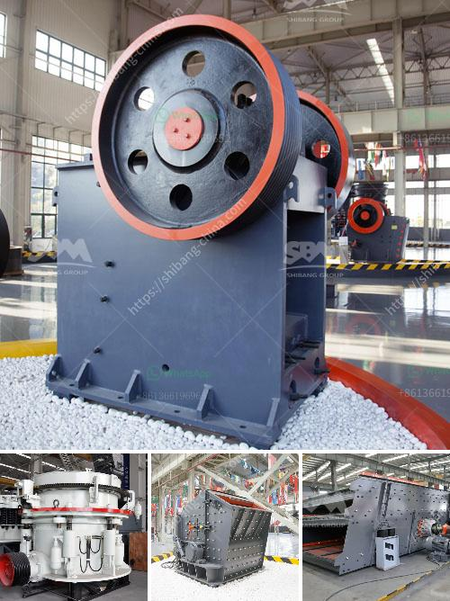

<h3>sell plant crusher of stone</h3>
Stone crushers are a fundamental part of the construction industry, as they are used for breaking down larger rocks into smaller stones. These machines are designed to crush hard materials, such as granite, marble, and limestone. They can also be used for recycling purposes, making them highly versatile.

In recent years, the demand for stone crushers has been increasing steadily, which has created a lucrative market for sellers. These machines are used in a variety of industries, including mining, construction, and landscaping. Due to their high efficiency and durability, stone crushers have become a popular choice among contractors and other professionals in the construction industry.

One of the leading stone crusher manufacturers, FTM Machinery, is a trusted and reliable brand known for its high-quality and good service. Over the years, they have become renowned for producing machinery that can withstand the harsh conditions of the mining industry. With their strong technical capabilities, they are able to design and manufacture stone crushers to meet the specific requirements of customers.

FTM Machinery offers several models of stone crushers with different specifications, such as jaw crushers, impact crushers, cone crushers, hammer crushers, and high-efficiency crushers. They are all uniquely designed to crush various types of stones, ranging from granite and limestone to river pebbles and sandstone. The crushing machines are equipped with advanced technology and features to maximize crushing efficiency.

Furthermore, FTM Machinery ensures that their stone crushers are environmentally friendly, with low dust emission and noise levels. These crushers are equipped with a dust suppression system to prevent the release of harmful particles into the air. Additionally, noise reduction technology is incorporated to minimize noise pollution, making them ideal for use in residential areas and other noise-sensitive environments.

Another advantage of buying stone crushers from FTM Machinery is that they come with comprehensive after-sales service. Customers can avail of technical support and assistance for any issues that may arise during the operation of the crushers. FTM Machinery also offers regular maintenance and spare parts replacement to prolong the lifespan of the machines.

In conclusion, stone crushers play a vital role in the construction industry, and FTM Machinery is a trusted name in the industry with its high-quality and reliable products. Selling these machines is a lucrative business opportunity for sellers, as they are widely used in the construction industry and can be used for various purposes. FTM Machinery provides a wide range of stone crushers with different specifications to meet the specific needs of customers. With their impeccable quality and comprehensive after-sales service, buying a stone crusher from FTM Machinery is a wise investment.
<h3>Contact us</h3><ul><li><strong>Whatsapp:&nbsp;<a href="https://wa.me/8613661969651">+8613661969651</a></strong></li><li><a href="https://swt.shibang-china.com/?git&amp;zhl&amp;sell plant crusher of stone"><strong>Online Service(chat now)</strong></a></li></ul><h3>Related</h3><ul><li><a href='price of raymond mill.md'>price of raymond mill</a></li><li><a href='crusher in pakistan.md'>crusher in pakistan</a></li><li><a href='calcite costing of processing equipment.md'>calcite costing of processing equipment</a></li><li><a href='stone crusher machine malaysia.md'>stone crusher machine malaysia</a></li><li><a href='renta de cribas vibratorias en mexico.md'>renta de cribas vibratorias en mexico</a></li></ul>