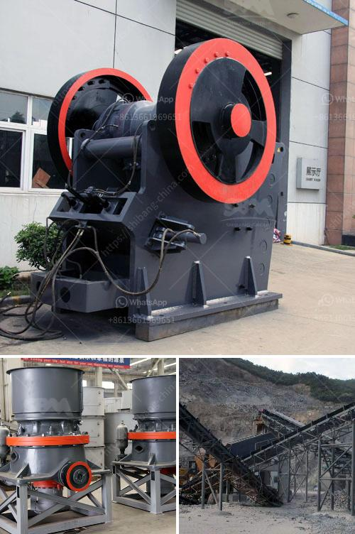

<h3>sells hammer mills in zimbabwe</h3>
Zimbabwe's agricultural sector holds immense potential to drive economic growth and improve food security. However, the lack of modern and efficient machinery often hinders productivity within the farming community. Among the essential tools necessary for successful crop production is the hammer mill—a crucial device that efficiently pulverizes grains into finer particles. This article examines the increasing demand for hammer mills in Zimbabwe, highlighting their benefits and impact on agricultural development.

A hammer mill is a versatile machine designed to shred or crush materials into smaller pieces. In the context of Zimbabwe's agricultural sector, hammer mills are used to pulverize maize, sorghum, beans, cotton, and other crops quickly and efficiently. By thoroughly breaking down the grains, farmers can optimize feed digestibility, reducing wastage and improving livestock performance.

Hammer mills provide Zimbabwean farmers with an opportunity to engage in value addition activities, transforming raw crops into processed goods. The pulverized grains can serve as animal feed, which attracts higher prices in the market. Additionally, farmers can produce flour, meal, or other food products for both domestic consumption and sale. Enhanced economic viability enables farmers to generate higher incomes and strengthens their ability to invest in more advanced agricultural machinery.

Zimbabwe faces periodic food shortages due to several factors, including climate change, insufficient infrastructure, and limited access to modern farming techniques. By adopting hammer mills, farmers can boost their overall crop production, ensuring a stable food supply within the country. The ability to process crops efficiently enhances the nutritional quality of animal feed, translating into healthier livestock and, eventually, increased meat, milk, and egg production.

A significant portion of Zimbabwe's farming community comprises small-scale farmers who depend on subsistence farming to meet their needs. The introduction of hammer mills has leveled the playing field for these farmers, enabling them to compete more effectively with larger agricultural enterprises. By investing in a hammer mill, small-scale farmers can increase their productivity, expand their market opportunities, and improve their economic well-being.

The demand for hammer mills in Zimbabwe has contributed to the growth of local manufacturing industries, promoting job creation and innovation. Local engineering firms have emerged to design, fabricate, and assemble these machines, supporting the economy and reducing reliance on imported agricultural machinery. The rise in hammer mill production has stimulated technological advancements and improved the overall competitiveness of Zimbabwe's manufacturing sector.

Recognizing the importance of hammer mills in driving agricultural development, the Zimbabwean government has initiated various support programs to facilitate access to these machines. Collaborations with financial institutions have made it easier for farmers to acquire hammer mills through affordable loan schemes. Moreover, capacity-building workshops and training programs are conducted to educate farmers on proper machine operation, maintenance, and repair, ensuring their longevity and sustainable usage.

Hammer mills have become an invaluable tool for Zimbabwe's agricultural sector, providing farmers with enhanced crop processing capabilities, economic viability, and increased food security. By investing in these machines, small-scale farmers can compete more effectively, while the overall agricultural sector reaps the benefits of improved productivity. The government's support and collaboration with financiers, along with capacity-building initiatives, play a vital role in ensuring the widespread availability and sustainable usage of hammer mills across the country.
<h3>Contact us</h3><ul><li><strong>Whatsapp:&nbsp;<a href="https://wa.me/8613661969651">+8613661969651</a></strong></li><li><a href="https://swt.shibang-china.com/?git&amp;zhl&amp;sells hammer mills in zimbabwe"><strong>Online Service(chat now)</strong></a></li></ul><h3>Related</h3><ul><li><a href='hammer mills produced in brazil.md'>hammer mills produced in brazil</a></li><li><a href='mini crusher hire johannesburg.md'>mini crusher hire johannesburg</a></li><li><a href='mobile crusher algerie.md'>mobile crusher algerie</a></li><li><a href='mobile coal cone crusher for hire malaysia.md'>mobile coal cone crusher for hire malaysia</a></li><li><a href='alluvial gold washing machine manufacturer.md'>alluvial gold washing machine manufacturer</a></li></ul>