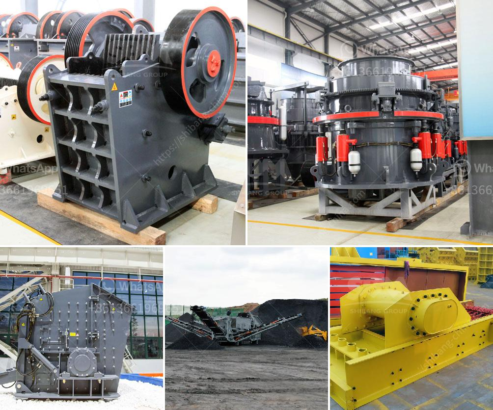

<h3>set up a quarry plant</h3>
Setting up a quarry plant is like injection into the real (productive) sector of the economy. Nigeria is richly endowed with granite stone and other related solid minerals such as marble, dolomite, and basalt. It is found in Enugu, Ebonyi, Kogi, Plateau, Ogun, Oyo, Osun, and Ekiti states.

In recent years, the demand for granite chippings has been on the increase, as it is used in the production of asphalt, cement, and concrete. With the ever-increasing population and rapid urbanization, the need for these materials will continue to rise.

To set up a quarry plant, one needs about seven-four million, naira, and the required machinery and equipment, which are readily available in the market and can be sourced locally. The basic raw material for the quarry business (deposits of stone) is freely available and ubiquitous in nature. However, since it is an unorganized sector scattered all over Nigeria, it is difficult to identify and evaluate its mineral reserves.

Proper geological mapping and feasibility studies should be carried out to determine the commercial viability of a proposed quarry plant before investing in it. The geological survey helps to identify suitable sites with sufficient deposits of stones that can be exploited for a long period to ensure a return on investment.

After securing a suitable site, the next step is to acquire the necessary licenses and permits from relevant authorities. The process includes obtaining an exploration license from the Ministry of Mines and Steel Development, as well as environmental and quarrying permits from the respective state agencies. Compliance with these regulations is crucial to avoid legal issues in the future and to operate in an environmentally responsible manner.

The next phase is to acquire the needed equipment, which includes crushers, excavators, dumpers, pay loaders, and other machineries used in quarry operations. It is advisable to engage the services of experts in the industry to assist in procuring the right equipment that will maximize productivity and minimize operational cost.

Once the equipment is in place, appropriate manpower needs to be employed. It is advisable to hire experienced professionals who are knowledgeable in quarry operations. These include geologists, engineers, operators, administrative staff, and security personnel. Training and safety measures should not be overlooked, as the operation of heavy machinery can be hazardous without proper precautions.

Effective marketing strategies should also be implemented to ensure the consistent supply of products and attract customers. A good marketing plan will help to establish a solid customer base and maintain a competitive advantage. This can be achieved through strategic partnerships, advertising, and offering competitive prices while meeting quality standards.

In conclusion, setting up a quarry plant is a profitable business venture and it can be run with minimal supervision and attention. It is a highly profitable project if well planned and managed. Remember, though, that a well-structured business plan, feasibility study, and environmental assessment are crucial to the success of your quarry plant. With dedication, hard work, and the right equipment and personnel, you can set up a quarry plant that will supply high-quality granite products and meet the demands of the construction industry.
<h3>Contact us</h3><ul><li><strong>Whatsapp:&nbsp;<a href="https://wa.me/8613661969651">+8613661969651</a></strong></li><li><a href="https://swt.shibang-china.com/?git&amp;zhl&amp;set up a quarry plant"><strong>Online Service(chat now)</strong></a></li></ul><h3>Related</h3><ul><li><a href='conveyor belts in peru.md'>conveyor belts in peru</a></li><li><a href='feldspar crusher for sale.md'>feldspar crusher for sale</a></li><li><a href='crusher dust collection system oman.md'>crusher dust collection system oman</a></li><li><a href='track mobile crusher.md'>track mobile crusher</a></li><li><a href='crusher price south africa.md'>crusher price south africa</a></li></ul>