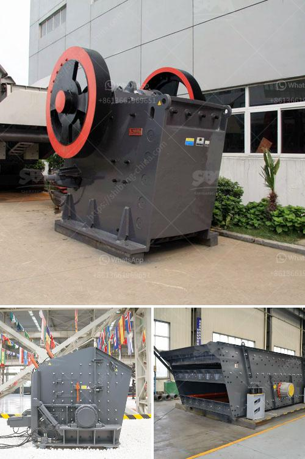

<h3>silica sand crusher price in india</h3>
Silica sand, commonly known as industrial sand, refers to one of the most common sand varieties used in construction and other industries. Silica sand crusher machines have been widely used for crushing and processing various materials, especially for crushing abrasive materials such as silica sand due to its high hardness. However, the price of silica sand crusher machine is an important factor for customers to choose suitable sand crusher machines.

In general, silica sand crusher machines are relatively expensive. The price of products with the same specifications from different manufacturers may vary greatly. For example, some manufacturers offer low-cost silica sand crusher machines, but the quality may not be satisfactory. On the other hand, some high-quality machine manufacturers may offer higher prices due to advanced technology and better after-sales service. Therefore, it is crucial for buyers to consider both price and quality factors before making a purchase.

In India, the price of silica sand crusher machines has always been a concern for many customers. The crusher machines produced by different manufacturers have different quality, performance, and after-sales service. Therefore, customers should compare the prices of different manufacturers when selecting a suitable product. Generally, there are several factors that affect the price of silica sand crusher machines in India.

Firstly, the production cost of the machine directly affects its price. The cost includes various factors like raw material cost, labor cost, energy cost, and other auxiliary costs. Manufacturers with higher production costs may offer more expensive products. Therefore, customers should choose products from manufacturers with reasonable production costs to get a better price.

Secondly, the quality of silica sand crusher machines is another crucial factor that determines its price. High-quality machines often have better performance and longer service life, which can provide customers with more value for their money. Inferior quality machines may have frequent breakdowns, malfunction, and higher maintenance costs. Therefore, it is advisable to choose machines from reputable manufacturers who can provide high-quality products.

Thirdly, the market demand and supply also affect the price of silica sand crusher machines in India. If the market demand is high and the supply is insufficient, the prices may increase. On the contrary, if the supply exceeds the demand, the prices may decrease. Therefore, it is necessary to pay attention to the market dynamics and choose the right time to purchase silica sand crusher machines at a more favorable price.

Furthermore, after-sales service is an essential factor for customers to consider when purchasing silica sand crusher machines. A good after-sales service can provide customers with technical support, maintenance, and spare parts supply. This can significantly reduce the total cost of owning and operating the machine over its lifespan. Customers should choose machines from manufacturers who can provide comprehensive and timely after-sales service.

In conclusion, the price of silica sand crusher machines in India is influenced by various factors, including production cost, machine quality, market demand and supply, and after-sales service. To ensure the best value for money, customers should compare prices, consider the quality and reputation of manufacturers, and choose a suitable time to purchase. It is recommended to prioritize quality and after-sales service over solely focusing on the price to get a long-lasting and efficient silica sand crusher machine.
<h3>Contact us</h3><ul><li><strong>Whatsapp:&nbsp;<a href="https://wa.me/8613661969651">+8613661969651</a></strong></li><li><a href="https://swt.shibang-china.com/?git&amp;zhl&amp;silica sand crusher price in india"><strong>Online Service(chat now)</strong></a></li></ul><h3>Related</h3><ul><li><a href='stone to sand crusher.md'>stone to sand crusher</a></li><li><a href='cara menentukan kapasitas belt conveyor.md'>cara menentukan kapasitas belt conveyor</a></li><li><a href='capacity 70 130tph impact crusher.md'>capacity 70 130tph impact crusher</a></li><li><a href='salt crusher machine pakistan.md'>salt crusher machine pakistan</a></li><li><a href='stone crusher machine price list in kenya.md'>stone crusher machine price list in kenya</a></li></ul>