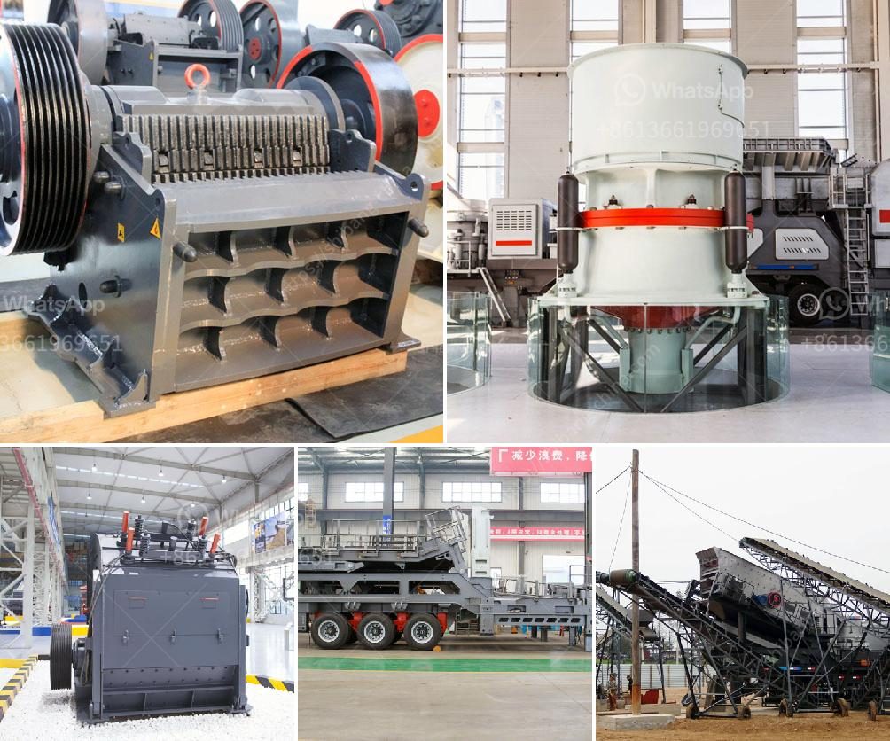

<h3>silica sand drying machine germany</h3>
In today's industrial world, silica sand is widely used for various purposes, be it for construction, ceramics, filtration, or even the production of concrete. However, despite its versatility, silica sand is a challenging material to process efficiently, especially when it comes to drying it. That's where the silica sand drying machine from Germany comes into play, offering a technological marvel that revolutionizes the drying process.

The traditional drying methods for silica sand involve using large-scale rotary dryers, which often lead to uneven drying and high energy consumption. However, with the introduction of the silica sand drying machine from Germany, these issues have become a thing of the past.

One of the key features of the silica sand drying machine is its innovative design. It consists of a rotating drum, which allows for a more controlled and uniform drying process. The drum is lined with heat-resistant materials that ensure maximum efficiency by preventing heat loss during drying. This design helps reduce energy consumption significantly compared to traditional drying methods.

Furthermore, the silica sand drying machine utilizes advanced technology to monitor and control the drying process accurately. It is equipped with temperature sensors and moisture analyzers that provide real-time data, allowing operators to adjust the drying parameters accordingly. This ensures that the silica sand is dried to the desired moisture content, eliminating the risk of over-drying or under-drying.

The German silica sand drying machine also incorporates state-of-the-art heat generators. These generators are highly efficient and eco-friendly, utilizing various fuel sources such as natural gas or biomass. By optimizing the combustion process, the heat generators produce high temperatures with minimal emissions, making them environmentally sustainable.

Moreover, the silica sand drying machine is equipped with sophisticated filtration systems. These systems capture and separate any particles or impurities from the drying air, ensuring that only clean and dry air is circulated within the machine. This not only improves the drying efficiency but also prevents the contamination of the dried silica sand.

The silica sand drying machine from Germany offers several advantages over traditional drying methods. Firstly, it reduces the drying time significantly, leading to improved productivity. Secondly, it produces a more uniform and consistent drying result, resulting in better product quality. Thirdly, it offers substantial energy savings, making it a cost-effective solution for large-scale silica sand drying operations.

Furthermore, the German silica sand drying machine is designed with ease of maintenance in mind. It is built with high-quality components that are durable and require minimal upkeep. Routine inspections and cleaning can be done quickly and effortlessly, ensuring uninterrupted operation and prolonged machine lifespan.

In conclusion, the silica sand drying machine from Germany is a technological marvel that has revolutionized the drying process for silica sand. It combines innovative design, advanced technology, and eco-friendly features to deliver efficient and consistent drying results. With its numerous advantages, this machine has become a game-changer in the silica sand industry, offering improved productivity, better product quality, energy savings, and ease of maintenance. It is undoubtedly a testament to German engineering and innovation.
<h3>Contact us</h3><ul><li><strong>Whatsapp:&nbsp;<a href="https://wa.me/8613661969651">+8613661969651</a></strong></li><li><a href="https://swt.shibang-china.com/?git&amp;zhl&amp;silica sand drying machine germany"><strong>Online Service(chat now)</strong></a></li></ul><h3>Related</h3><ul><li><a href='process chart of sand washing plant.md'>process chart of sand washing plant</a></li><li><a href='granite crusher plant.md'>granite crusher plant</a></li><li><a href='wet ball milling process.md'>wet ball milling process</a></li><li><a href='stone crusher plant for sale philippines.md'>stone crusher plant for sale philippines</a></li><li><a href='quartz stone processing machine.md'>quartz stone processing machine</a></li></ul>