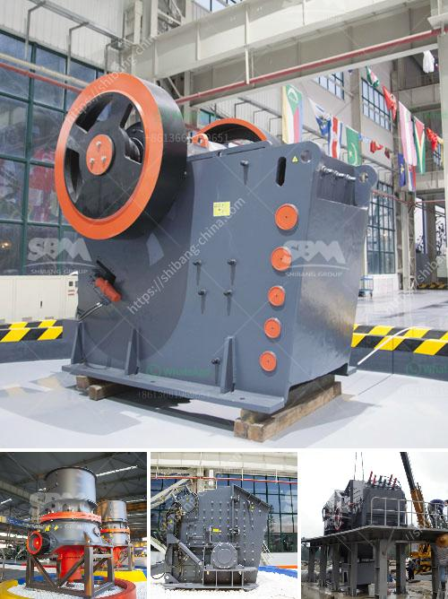

<h3>silica sand price per ton</h3>
Silica sand, also known as quartz sand, is a versatile material widely used for various commercial and industrial applications. It is a key component in the production of glass, ceramics, concrete, and other building materials. The steady rise in demand for silica sand has led to an increase in its price per ton globally.

The price of silica sand varies depending on factors such as purity, location, transportation costs, and market demand. In general, prices can range anywhere from $30 to $50 per ton. However, certain regions with high-quality silica deposits and efficient mining operations can command prices upwards of $100 per ton.

One important factor influencing the price of silica sand is the level of impurities present in the material. The purer the silica sand, the higher its demand and price. Industrial applications, such as in the production of glass, require high-purity silica sand to achieve desired characteristics like clarity and strength. Therefore, suppliers of highly pure silica sand can often charge a premium price.

Another factor impacting prices is the location of silica sand deposits. Some regions, such as the United States, have abundant reserves and well-established mining operations, resulting in more competitive prices. However, regions with limited local supply may have higher prices due to the costs associated with transportation and importation.

Market demand and supply dynamics also significantly affect silica sand prices. Rapid urbanization, infrastructural development, and increased manufacturing activities contribute to the growing demand for silica sand. As demand outstrips supply, prices tend to rise. Conversely, when supply exceeds demand, prices may decrease.

It is worth noting that silica sand prices can be subject to volatility due to various factors, such as changes in mining regulations, natural disasters, or shifts in buyer preferences. Therefore, it is important for buyers and sellers to monitor market conditions and trends to make informed decisions.

In conclusion, the price of silica sand per ton is subject to multiple factors, including purity, location, transportation costs, and market demand. While prices generally range from $30 to $50 per ton, certain regions with high-quality deposits can command prices upwards of $100 per ton. Understanding these factors and staying informed about market trends is crucial for buyers and sellers in the silica sand industry.
<h3>Contact us</h3><ul><li><strong>Whatsapp:&nbsp;<a href="https://wa.me/8613661969651">+8613661969651</a></strong></li><li><a href="https://swt.shibang-china.com/?git&amp;zhl&amp;silica sand price per ton"><strong>Online Service(chat now)</strong></a></li></ul><h3>Related</h3><ul><li><a href='iron ore crushed machine second hand.md'>iron ore crushed machine second hand</a></li><li><a href='granite crusher plant.md'>granite crusher plant</a></li><li><a href='rod mill manufacturer in europe.md'>rod mill manufacturer in europe</a></li><li><a href='kaolin processing unit.md'>kaolin processing unit</a></li><li><a href='sand making production line.md'>sand making production line</a></li></ul>