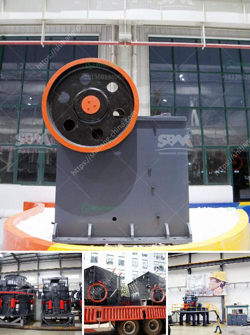

<h3>silico manganese manufacturing equipment</h3>
Silico manganese, also known as ferro silicon manganese, is an alloy composed of manganese, silicon, and iron. It is widely used in various industries due to its excellent properties, such as high strength, corrosion resistance, and thermal stability. The manufacturing process of silico manganese requires specialized equipment to ensure the quality and efficiency of production.

One of the key pieces of equipment used in the manufacturing of silico manganese is an electric arc furnace (EAF). The EAF is responsible for melting and refining the raw materials, which include manganese ore, silicon, and iron. The EAF operates at extremely high temperatures, reaching up to 1800°C, to facilitate the fusion of the ingredients.

The EAF is composed of a furnace shell, an electrode system, and a transformer system. The furnace shell is typically made of refractory materials to withstand the high temperatures and chemical reactions that occur during the melting process. The electrode system consists of carbon electrodes that conduct electricity and generate the electric arc required for the melting process. The transformer system supplies the high voltage and power required to operate the EAF.

Another important equipment in silico manganese manufacturing is a ladle refining furnace (LRF). The LRF is used to further refine the molten metal produced by the EAF. It removes impurities such as sulfur and phosphorous, and adjusts the composition of the alloy to meet specific requirements. The LRF is equipped with a stirring mechanism that ensures uniform mixing of the molten metal and facilitates the removal of impurities.

In addition to the EAF and LRF, there are other auxiliary equipment used in the manufacturing of silico manganese. These include crushers, sieving machines, and magnetic separators. Crushers are used to break down the raw materials into smaller sizes, facilitating the subsequent processing steps. Sieving machines are used to separate different particle sizes of the raw materials, ensuring uniformity in the alloy composition. Magnetic separators are used to remove any magnetic impurities from the raw materials, such as iron particles.

The manufacturing process of silico manganese involves several steps, including raw material preparation, smelting, refining, and casting. Each step requires specific equipment to ensure optimal results. The quality and efficiency of the manufacturing equipment play a crucial role in determining the quality of the final product.

Manufacturers of silico manganese equipment continuously strive to improve the performance and reliability of their machines. They invest in research and development to develop innovative technologies and designs that enhance productivity, reduce energy consumption, and minimize environmental impact. This includes the use of advanced automation and control systems to optimize process parameters and ensure consistent product quality.

In conclusion, the manufacturing of silico manganese requires specialized equipment to ensure efficient and high-quality production. Electric arc furnaces, ladle refining furnaces, crushers, sieving machines, and magnetic separators are among the key equipment used in the process. Manufacturers are constantly innovating to improve the performance and reliability of these machines to meet the growing demand for silico manganese in various industries.
<h3>Contact us</h3><ul><li><strong>Whatsapp:&nbsp;<a href="https://wa.me/8613661969651">+8613661969651</a></strong></li><li><a href="https://swt.shibang-china.com/?git&amp;zhl&amp;silico manganese manufacturing equipment"><strong>Online Service(chat now)</strong></a></li></ul><h3>Related</h3><ul><li><a href='sand crusher machine manufacturers.md'>sand crusher machine manufacturers</a></li><li><a href='aggregate manufacturing process.md'>aggregate manufacturing process</a></li><li><a href='small mining equipment price in south africa.md'>small mining equipment price in south africa</a></li><li><a href='production quarzt sand machine.md'>production quarzt sand machine</a></li><li><a href='canada gold mining equipment.md'>canada gold mining equipment</a></li></ul>