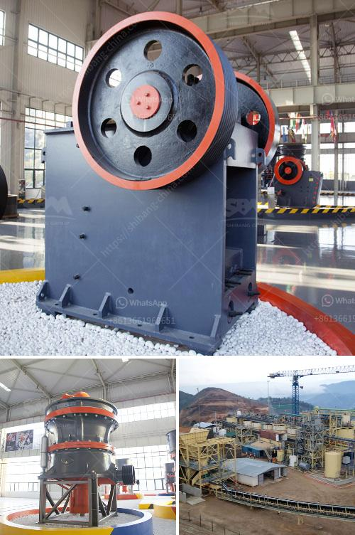

<h3>silicon ore processing equipment</h3>
Silicon, the second most abundant element on the Earth's crust, is widely used in various industries due to its exceptional properties. However, before it can be utilized for manufacturing purposes, silicon ore goes through a complex processing procedure. In this article, we will explore the different types of equipment involved in silicon ore processing and how they contribute to the production of high-quality silicon.

The first step in silicon ore processing is the extraction of raw material from the earth. Primarily extracted by open-pit mining, silicon ore is typically found in quartz veins or beach sands. Once the silicon ore has been excavated, it is transported to a nearby processing plant for further refinement.

Crushing and grinding are the initial stages of silicon ore processing, where the extracted ore is reduced in size. To accomplish this, crushers and mills are utilized. Crushers, such as jaw crushers and cone crushers, break down large chunks of ore into smaller, more manageable pieces. Grinding mills, on the other hand, use friction and impact to break down the ore into fine particles. These processes increase the surface area of the ore, allowing for more effective chemical reactions during subsequent stages.

Following the crushing and grinding stage, the ore is subjected to various separation techniques to remove impurities. Froth flotation, a widely used separation method, involves mixing the pulverized ore with water and chemicals to create a froth. The valuable silicon particles attach to the froth, while the impurities separate, resulting in a purified silicon ore concentrate. This concentrate is then dried and transported for further processing.

One of the key processes in silicon ore processing is smelting, where the concentrated ore undergoes high-temperature treatment in a furnace. During smelting, the ore, along with a reducing agent such as carbon or charcoal, undergoes a chemical reaction that extracts silicon from the concentrate. The silicon is then collected in the form of molten silicon, ready for further purification.

Purification is crucial to produce high-purity silicon, which is essential for end-use applications such as semiconductors and solar panels. Distillation is commonly employed to achieve this. The melted silicon is heated to high temperatures, causing impurities to vaporize and separate from the silicon. The purified silicon is then cooled and solidified into ingots, which can be further processed into various shapes and sizes based on application requirements.

It is worth mentioning that the equipment used in silicon ore processing is continuously evolving to optimize efficiency and reduce environmental impact. Advanced technologies such as automated crushing and grinding systems, as well as energy-efficient furnaces, have been developed to enhance productivity and sustainability.

In conclusion, silicon ore processing is a multi-step procedure involving the extraction, crushing, grinding, separation, smelting, and purification of silicon ore to obtain high-quality silicon. Each step requires specialized equipment designed to handle the unique characteristics of silicon ore and ensure the production of refined silicon for various industries. As technology advances, the silicon ore processing equipment continues to evolve, enabling the production of silicon with higher purity and greater efficiency.
<h3>Contact us</h3><ul><li><strong>Whatsapp:&nbsp;<a href="https://wa.me/8613661969651">+8613661969651</a></strong></li><li><a href="https://swt.shibang-china.com/?git&amp;zhl&amp;silicon ore processing equipment"><strong>Online Service(chat now)</strong></a></li></ul><h3>Related</h3><ul><li><a href='china make vertical roller mill.md'>china make vertical roller mill</a></li><li><a href='stone sand making process pdf.md'>stone sand making process pdf</a></li><li><a href='all model vsi crusher.md'>all model vsi crusher</a></li><li><a href='crusher prices stone crusher primary and secondary.md'>crusher prices stone crusher primary and secondary</a></li><li><a href='equipment equipments used in gravel crushing.md'>equipment equipments used in gravel crushing</a></li></ul>