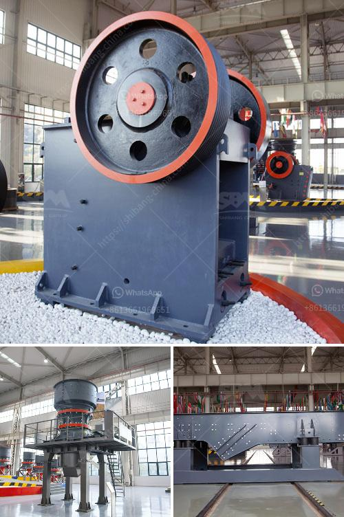

<h3>simple stone crushers kenya</h3>
If you are in the market for a simple stone crusher, Kenya has got you covered. Stone crushers have been used for centuries and have played a vital role in the construction industry as well as in the mining of precious stones and metals. Whatever your requirements, you 'll find the perfect service-oriented solution to match your specific needs with our help.We are here for your questions anytime 24/7, welcome your consultation.

Crushers come in different sizes and capacities, which vary from 100-300 tons per hour. Small-scale crushers are ideal for small projects and those with limited resources. These machines are very affordable, making them perfect for homeowners who may only need to use them for a short period of time.

There are different types of stone crushers in Kenya, including jaw crushers, cone crushers, impact crushers, and others. These machines are used to break down large materials into smaller pieces, which make them easier to transport and work with. They are usually used in construction sites and quarries to crush stones into various sizes.

One of the factors that you should consider when buying a stone crusher is the size of the finished product. The size range of crushers varies depending on the purpose of the crusher. If you are using it for heavy-duty construction or mining, you may want to choose a large-sized crusher. However, if you are working on a small-scale project, such as a DIY landscaping project, a smaller crusher may be more suitable.

Another factor to consider when buying a stone crusher is the type of material you will be crushing. Different crushers are used for different types of stone. For example, a jaw crusher is used for crushing large stones into small pieces, which are used as construction materials. Cone crushers and impact crushers are also commonly used for secondary crushing of stones.

In conclusion, there are various types of stone crushers in Kenya available today. They vary in capability, size, and application. The choice of a crusher will depend on your requirements and the nature of the material you need to crush. Whether you are planning to invest in a small stone crusher for a DIY landscaping project or a larger one for commercial purposes, there are plenty of options available in Kenya.
<h3>Contact us</h3><ul><li><strong>Whatsapp:&nbsp;<a href="https://wa.me/8613661969651">+8613661969651</a></strong></li><li><a href="https://swt.shibang-china.com/?git&amp;zhl&amp;simple stone crushers kenya"><strong>Online Service(chat now)</strong></a></li></ul><h3>Related</h3><ul><li><a href='cone crushers washing system.md'>cone crushers washing system</a></li><li><a href='cone crusher calculation.md'>cone crusher calculation</a></li><li><a href='sand making machine crusher.md'>sand making machine crusher</a></li><li><a href='gypsum chromium limestone mining.md'>gypsum chromium limestone mining</a></li><li><a href='portable crusher rental in las vegas.md'>portable crusher rental in las vegas</a></li></ul>