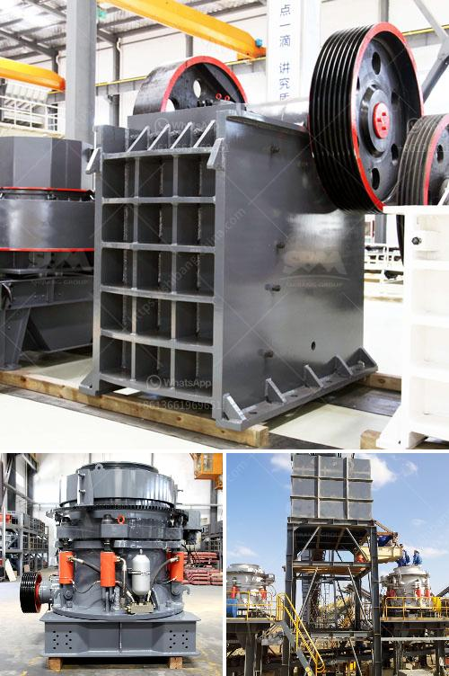

<h3>size to a jaw crusher and cone crusher</h3>
When it comes to size reduction in mining and quarrying industries, jaw crushers and cone crushers are the ultimate choices. They are rugged, durable, and efficient machines that can handle even the toughest of materials. These machines are utilized in a variety of applications including rock crushing, sand and gravel production, construction, and demolition recycling. But what exactly is the ideal size for a jaw crusher and cone crusher? Let's find out.

A jaw crusher is a compression type crusher, comprised of a fixed jaw and moving jaw positioned in a V-shaped formation. The movable jaw compresses materials against the fixed jaw, reducing the size of the material to smaller and finer particles. Typical feed materials for jaw crushers include rock, limestone, and recyclable materials.

The size of a jaw crusher is determined by the rectangular or square opening at the top of the jaws. For instance, a 22 x 30 jaw crusher has an opening of 22" by 30", a 46 x 46 jaw crusher has a opening of 46" square. Generally, primary jaw crushers have larger openings, while secondary crushers have smaller openings.

The maximum feed size for a jaw crusher should be about 85% of the gape which is the distance between the jaws at the feed opening. Don't exceed this amount, as it could cause damage to the crusher, increase wear on the jaws, and decrease the overall efficiency of the machine.

A cone crusher is a compression type of rock crusher that is mainly used for materials like granite, basalt, and river gravel. It is widely utilized in the secondary and tertiary crushing stages in aggregates production and mining operations. Cone crushers are often used to produce the final product in crushing circuits, as they can produce a finer product compared to jaw crushers.

The size of a cone crusher is defined by its diameter at the top of the crushing chamber. For example, a 60" cone crusher has a 60" diameter crushing head. For secondary cone crushers, the feed opening should be about 75% to 80% of the minimum discharge opening.

The gape determines the maximum size of material that can be accepted. Maximum feed sizes will vary depending on the type of material, gradation, and characteristics of the feed. Make sure to consult the manufacturer's guidelines to ensure the correct equipment is chosen for your application.

In conclusion, the size of a jaw crusher and cone crusher plays a crucial role in the efficiency and productivity of crushing operations. However, there is no one-size-fits-all solution. Each application requires careful consideration of the feed material, desired product size, and capacity requirements. It is always recommended to consult with experts and manufacturers to ensure the right choice is made for your specific needs.
<h3>Contact us</h3><ul><li><strong>Whatsapp:&nbsp;<a href="https://wa.me/8613661969651">+8613661969651</a></strong></li><li><a href="https://swt.shibang-china.com/?git&amp;zhl&amp;size to a jaw crusher and cone crusher"><strong>Online Service(chat now)</strong></a></li></ul><h3>Related</h3><ul><li><a href='stone crushing equipment available.md'>stone crushing equipment available</a></li><li><a href='used silica sand washing plant for sale.md'>used silica sand washing plant for sale</a></li><li><a href='coal washing process machine.md'>coal washing process machine</a></li><li><a href='pe jaw crusher price list.md'>pe jaw crusher price list</a></li><li><a href='hammer mill in bogota.md'>hammer mill in bogota</a></li></ul>