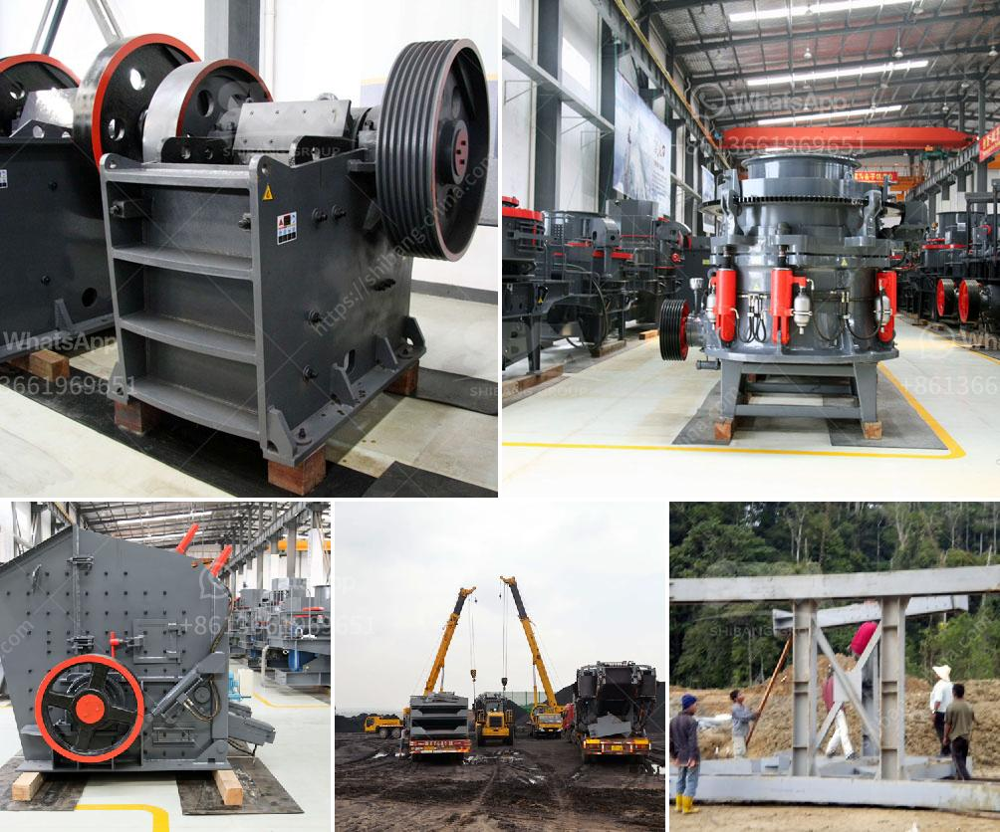

<h3>slag crusher plant india</h3>
Slag, a by-product of steel production, is often discarded as waste material. However, with advancements in technology, slag can now be recycled and used in various industries. One such industry that benefits from the utilization of slag is the construction industry. In India, there are several slag crusher plants that are equipped with different types of crushing machinery to ensure smooth and efficient crushing operations.

Slag crusher plants in India successfully installed in several cities and utilized for crushing refractory's, stone, coal, and various other products. Here are some highlights of our collaborations:

- Robust Infrastructural Development: We have successfully installed our crusher plants in significant cities like Mumbai, Delhi, Kolkata, Chennai, Hyderabad, and Bangalore. This widespread presence allows us to cater to the demands of a broad customer base throughout India.

- Advanced Crushing Technology: Our slag crusher plants utilize cutting-edge technology and machinery to ensure efficient crushing and screening of slag. These plants use various crushers, such as jaw crushers, impact crushers, cone crushers, and grinding mills. Depending on the feed size and desired output size, we can recommend suitable crusher machines for the specific needs of our customers.

- Customized Solutions: At our slag crusher plant, we understand that every customer has different requirements and preferences. Therefore, we offer customized solutions to meet their specific needs. Our team of experts works closely with our customers to understand their requirements and recommend the most suitable equipment and crushing process for their needs.

- Cost-effective: Our slag crusher plants are designed to provide cost-effective crushing solutions. By recycling slag, we not only reduce waste but also save costs on material procurement. Furthermore, the utilization of slag in construction projects helps reduce the environmental impact caused by the extraction and processing of natural resources.

- High-quality Products: Our slag crusher plants are designed to produce high-quality products. By utilizing advanced crushing technology, we can ensure that the final product meets the required specifications and standards. This allows our customers to use the recycled slag in construction projects with confidence.

- After-sales Support: We believe in providing comprehensive after-sales support to our customers. Our team of experts is available to assist customers with any queries or issues they may face. We also offer maintenance services to ensure that the crusher plant operates smoothly and efficiently.

In conclusion, slag crusher plants in India have made significant advancements in terms of technology and machinery to provide efficient crushing solutions. These plants are designed to recycle and utilize slag, which not only helps in waste reduction but also contributes to sustainable development. With our customized solutions, cost-effective operations, and high-quality products, we strive to cater to the diverse needs of our customers. By utilizing slag in various construction projects, India is moving towards a greener and more sustainable future.
<h3>Contact us</h3><ul><li><strong>Whatsapp:&nbsp;<a href="https://wa.me/8613661969651">+8613661969651</a></strong></li><li><a href="https://swt.shibang-china.com/?git&amp;zhl&amp;slag crusher plant india"><strong>Online Service(chat now)</strong></a></li></ul><h3>Related</h3><ul><li><a href='barite processing plant feasibility study.md'>barite processing plant feasibility study</a></li><li><a href='pioneer ve rock crusher.md'>pioneer ve rock crusher</a></li><li><a href='stone crusher plant cost saudi.md'>stone crusher plant cost saudi</a></li><li><a href='stone crusher for sale in south philippines.md'>stone crusher for sale in south philippines</a></li><li><a href='ball mill 10 tph.md'>ball mill 10 tph</a></li></ul>