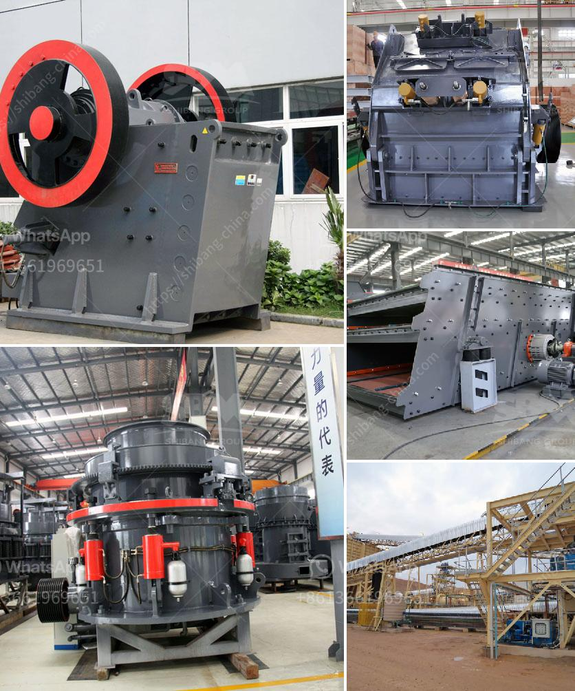

<h3>slag powder machine</h3>
Slag powder machine, also known as slag micro-powder grinding mill, is a kind of equipment that uses slag powder particles to produce powder. The finished product has a wide range of uses in the industry, from chemical manufacturing to construction and agriculture.

Slag powder is a by-product of the steel manufacturing process. It is produced when the iron ore and flux materials are melted together in a blast furnace. This molten mixture is then cooled rapidly, which leads to the formation of slag. In the past, this slag was mostly discarded as waste, causing environmental pollution.

However, with the advancement of technology, the value of slag powder has been recognized. Now, slag powder is widely used in various industries due to its unique properties. For example, it can be used as a raw material for cement production, which improves the strength and durability of concrete. Additionally, slag powder can be used as a filler in plastic and rubber products, enhancing their performance.

The slag powder machine is designed to grind the crude slag into fine powder. The grinding energy is transferred to the slag particles, causing it to break down into smaller particles. The machine uses high-pressure air to blow the slag powder into the classifier, and the classified powder is collected by the cyclone and bag filter.

One of the key advantages of the slag powder machine is its efficiency. It can grind large quantities of slag in a short time, reducing the overall processing time and saving operating costs. Additionally, the machine has a high powder collection rate, ensuring that no valuable slag powder is wasted.

Another advantage of using the slag powder machine is the environmental benefits. By using the machine, companies can recycle and reuse the slag generated during the steel manufacturing process, reducing waste and pollution. This contributes to a cleaner and greener environment.

Furthermore, the slag powder machine is easy to operate and maintain. It has a simple structure and requires minimal manual intervention. The machine is also equipped with safety features to ensure the operator's safety during operation.

In conclusion, the slag powder machine is a valuable tool in various industries. Its ability to grind slag into fine powder enhances the properties of various products, while its efficiency and environmental benefits make it a preferred choice for companies. With its easy operation and maintenance, the slag powder machine is an excellent investment for businesses seeking to improve their manufacturing processes.
<h3>Contact us</h3><ul><li><strong>Whatsapp:&nbsp;<a href="https://wa.me/8613661969651">+8613661969651</a></strong></li><li><a href="https://swt.shibang-china.com/?git&amp;zhl&amp;slag powder machine"><strong>Online Service(chat now)</strong></a></li></ul><h3>Related</h3><ul><li><a href='small scale mining equipment south africa price.md'>small scale mining equipment south africa price</a></li><li><a href='limestone treatment plant.md'>limestone treatment plant</a></li><li><a href='crusher business aggregate.md'>crusher business aggregate</a></li><li><a href='price for jaw crusher.md'>price for jaw crusher</a></li><li><a href='rock screening plants usa.md'>rock screening plants usa</a></li></ul>