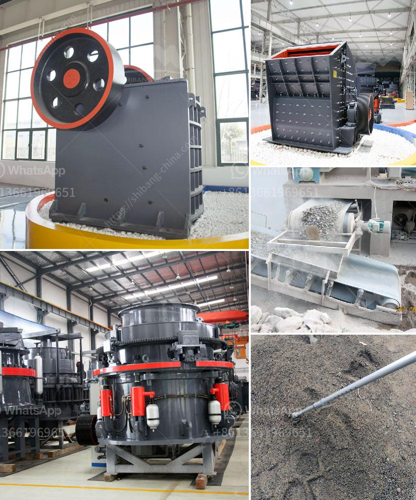

<h3>slag processing plant details</h3>
Slag, a byproduct of industrial activities such as smelting and ore processing, has long been considered a waste material. However, with the advancement of technology and innovative processes, slag has transformed into a valuable resource. Slag processing plants have emerged as a groundbreaking solution for reusing this once overlooked material. This article delves into the crucial details of a slag processing plant, explaining its functions, benefits, and the processes involved.

A slag processing plant serves a dual purpose. Firstly, it allows for the efficient disposal of slag, which would previously have been sent to landfill sites. By processing the slag, the plant minimizes environmental impact and reduces the strain on already overcrowded disposal sites.

Secondly, a slag processing plant facilitates the extraction of valuable commodities from the slag. Depending on the composition of the slag, different extraction processes can be employed to produce a range of useful materials. These materials often find applications in construction, road construction, cement production, and even agriculture, among others.

The specific processes implemented in a slag processing plant may vary depending on the desired outcome and composition of the slag. However, broadly speaking, the following steps are typically involved:

1. Crushing and Screening: The first step in the processing plant involves crushing the slag into smaller pieces, followed by screening to separate different size fractions. This process ensures efficient subsequent processing and allows for segregation of any undesirable components.

2. Magnetic Separation: Magnetic separation is a commonly used method to extract iron and ferrous components from the slag. This process involves passing the crushed slag through powerful magnets to separate the magnetic materials. The resulting iron-rich product is often sold for steelmaking or other industrial purposes.

3. Non-Ferrous Metal Recovery: After the magnetic separation, non-ferrous metals such as copper, lead, and zinc can be recovered through additional processes. Depending on the specific composition of the slag and desired metal extraction, techniques like flotation, gravity separation, and hydrometallurgical processes are employed.

4. Chemical Treatment: In some cases, certain unwanted components, such as sulfur or phosphorus, may be present in the slag. Chemical treatments are then used to remove or reduce these harmful elements, making the slag more usable and environmentally friendly.

A slag processing plant offers an innovative solution to deal with the immense quantities of slag generated by various industrial processes. It not only allows for efficient disposal but also transforms the slag into valuable commodities. Through processes such as crushing, screening, magnetic separation, and chemical treatment, a slag processing plant enables the extraction of iron, non-ferrous metals, and other valuable materials. Embracing this sustainable approach not only reduces waste but also contributes to the conservation of natural resources and the protection of the environment.
<h3>Contact us</h3><ul><li><strong>Whatsapp:&nbsp;<a href="https://wa.me/8613661969651">+8613661969651</a></strong></li><li><a href="https://swt.shibang-china.com/?git&amp;zhl&amp;slag processing plant details"><strong>Online Service(chat now)</strong></a></li></ul><h3>Related</h3><ul><li><a href='total cost of stone crushing unit in india.md'>total cost of stone crushing unit in india</a></li><li><a href='jaw crusher for sale in philippines.md'>jaw crusher for sale in philippines</a></li><li><a href='small scale prospector ore crusher.md'>small scale prospector ore crusher</a></li><li><a href='jaw crusher suppliers south africa.md'>jaw crusher suppliers south africa</a></li><li><a href='quarry ccrusher equipment price.md'>quarry ccrusher equipment price</a></li></ul>