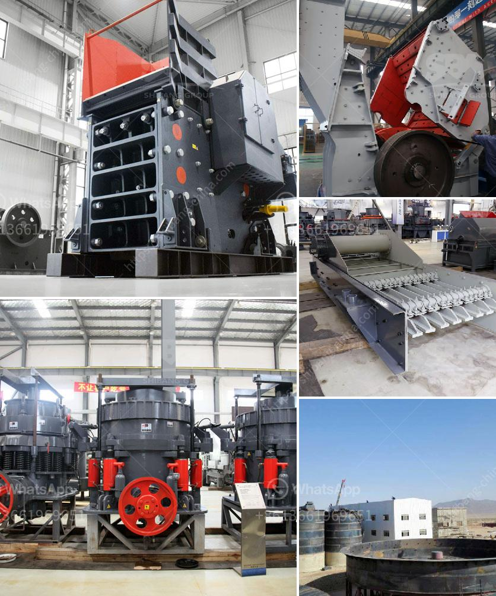

<h3>slinger conveyor belt speed</h3>
In the world of material handling and construction, efficiency and precision are crucial factors that can make or break a project. One of the essential components in this field is the slinger conveyor belt, a versatile machine used for efficiently spreading various materials, such as aggregates, soil, sand, and mulch. The speed at which the slinger conveyor belt operates plays a vital role in achieving optimal performance and minimizing wastage. This article will delve into the significance of belt speed and finding the perfect balance for smooth transportation.

The main objective of using a slinger conveyor belt is to quickly and accurately transport materials over long distances. To achieve this, the belt speed needs to be fast enough to ensure a continuous and even flow of materials, while also avoiding spillage or overload issues. However, setting the speed too high can result in several drawbacks. Firstly, excessive speed can lead to material bouncing off the belt or being flung too far away, causing uneven distribution and potential damage to surrounding areas and personnel. Secondly, if the speed is too high in relation to the size and capacity of the machine, it can strain the motor, leading to premature wear and frequent breakdowns.

On the other hand, setting the belt speed too low can result in inefficient transportation. The materials may not be evenly distributed and might pile up on the conveyor belt, causing blockages and possible damage to the equipment. Additionally, it may cause delays in operations, as the material flow will be significantly slower, reducing productivity and affecting the project timeline.

To find the perfect balance for slinger conveyor belt speed, several factors need to be taken into consideration. Firstly, the type of material being transported plays a crucial role. Different materials have varying densities and levels of moisture content, which affects their flowability and behavior on the conveyor belt. For example, dry and coarse aggregates may require a higher belt speed to maintain a consistent flow, while wet and fine materials may need a slower speed to avoid excessive drip and splatter.

The length and incline of the conveyor belt also impact the ideal speed. A longer belt or a steep incline typically requires a slower speed to maintain stability and prevent issues like slippage or material spillage. Moreover, the capacity of the slinger conveyor and the required output of material per hour should be considered. A higher capacity machine may accommodate a faster belt speed, while a lower capacity machine may necessitate a slower speed to prevent overloading and strain on the motor.

In conclusion, finding the optimal speed for a slinger conveyor belt is essential for achieving efficient and precise material transportation in construction and material handling projects. Balancing the speed requires careful consideration of the type of material, the length and incline of the belt, as well as the machine's capacity. It is crucial to strike the right balance, avoiding excessive speed that may cause material wastage or overload issues, while also ensuring a fast enough speed to maintain a continuous flow of materials. By finding this equilibrium, operators can maximize productivity, minimize downtime, and execute projects with greater efficiency.
<h3>Contact us</h3><ul><li><strong>Whatsapp:&nbsp;<a href="https://wa.me/8613661969651">+8613661969651</a></strong></li><li><a href="https://swt.shibang-china.com/?git&amp;zhl&amp;slinger conveyor belt speed"><strong>Online Service(chat now)</strong></a></li></ul><h3>Related</h3><ul><li><a href='quarry crusher in zambia.md'>quarry crusher in zambia</a></li><li><a href='grinding machines for minerals in indonesia.md'>grinding machines for minerals in indonesia</a></li><li><a href='prices for stone crushing machine south africa.md'>prices for stone crushing machine south africa</a></li><li><a href='crushing plant supplier.md'>crushing plant supplier</a></li><li><a href='crusher price in oman.md'>crusher price in oman</a></li></ul>