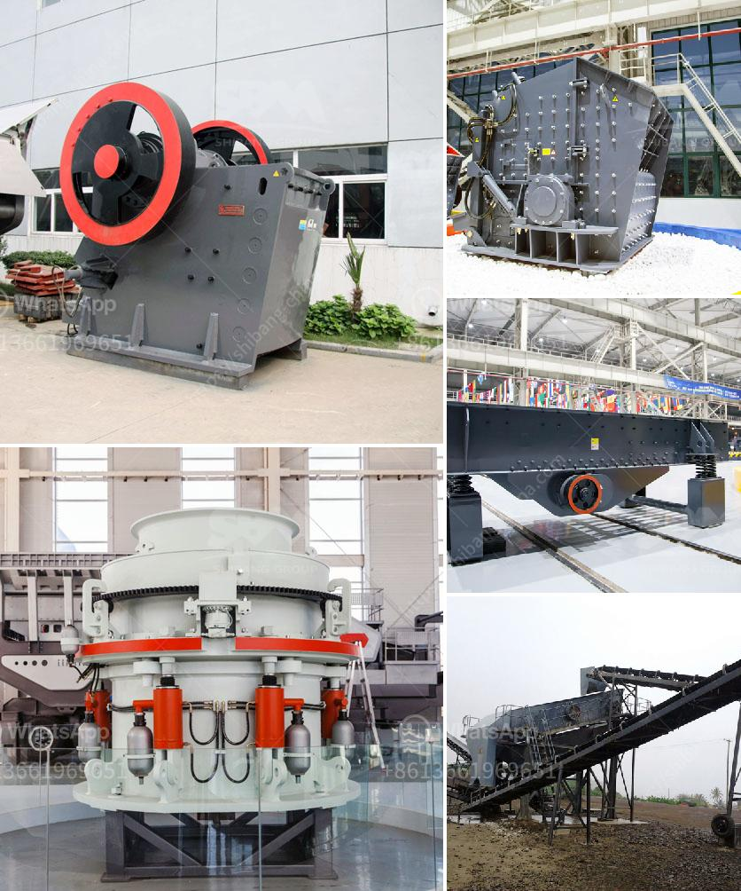

<h3>small concrete crusher rental nj</h3>
Recycling of demolition debris is becoming increasingly important in today's world from an environmental perspective. Construction and demolition waste is a huge problem worldwide, considering the massive amounts generated daily. As a result, finding sustainable solutions for the disposal of these materials has become imperative.

One of the most efficient and cost-effective methods of handling construction waste is by renting a small concrete crusher in NJ. These compact machinery are ideal for demolition projects, as they allow you to process concrete onsite, saving tons of transportation costs. Let's take a closer look at the benefits of choosing a small concrete crusher rental in NJ.

The first advantage of renting a small concrete crusher is its ability to squeeze into tight spaces. These compact machines are designed to fit into narrow and confined construction areas, ensuring maximum productivity regardless of the space limitations. Whether you're working in a crowded urban area or a small backyard, a small concrete crusher will remain flexible and deliver outstanding results.

Another advantage is the versatility of these crushers. They are not solely designed to process concrete; they can also handle other materials like bricks, rocks, asphalt, and more. With a small concrete crusher rental in NJ, you can transform a wide variety of materials into reusable aggregates, making your project more sustainable and cost-effective.

Time is money in construction, and renting a small concrete crusher will save you plenty of both. Crushing concrete onsite eliminates the need to haul the material away and then bring in new aggregates. By recycling concrete immediately, you can reduce project timelines while boosting efficiency. Additionally, you may even save on labor costs by eliminating the need for manual sorting and handling of debris.

One of the most significant benefits of utilizing a small concrete crusher rental in NJ is reducing landfill waste. Construction and demolition waste account for a significant portion of the waste that ends up in landfills. By recycling these materials, you can contribute to a more sustainable future. By crushing concrete onsite, you effectively decrease the amount of waste that needs to be transported and disposed of, lowering your environmental impact.

When it comes to finding the right small concrete crusher rental in NJ, select a reputable company that offers top-quality equipment and excellent customer service. Look for a company with a wide range of crusher models to choose from, ensuring that you will find the perfect match for your project needs. Additionally, inquire about any additional services they might offer, such as equipment maintenance and operator training.

In conclusion, small concrete crusher rentals in NJ offer a fantastic solution for construction projects of all sizes. With their compact design, versatility, and ability to process various materials, these crushers provide an efficient and cost-effective way to handle demolition debris. By choosing to rent a small concrete crusher, you can save time, money, and reduce your environmental impact, making it a win-win situation for both your project and the planet.
<h3>Contact us</h3><ul><li><strong>Whatsapp:&nbsp;<a href="https://wa.me/8613661969651">+8613661969651</a></strong></li><li><a href="https://swt.shibang-china.com/?git&amp;zhl&amp;small concrete crusher rental nj"><strong>Online Service(chat now)</strong></a></li></ul><h3>Related</h3><ul><li><a href='river pebble crusher.md'>river pebble crusher</a></li><li><a href='pine cone coal manufacturing machinery.md'>pine cone coal manufacturing machinery</a></li><li><a href='new hammer mill pricing.md'>new hammer mill pricing</a></li><li><a href='size to a jaw crusher and cone crusher.md'>size to a jaw crusher and cone crusher</a></li><li><a href='ball mill suppliers in india.md'>ball mill suppliers in india</a></li></ul>