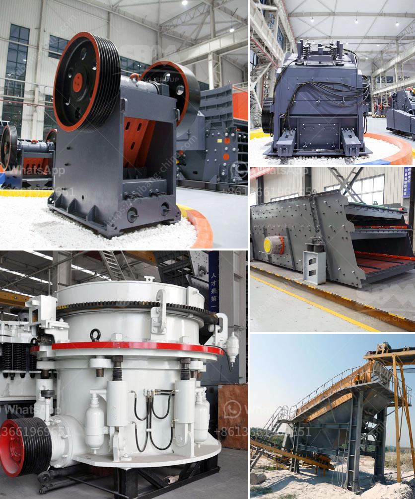

<h3>small cone crusher for sale za</h3>
Cone crushers are commonly used for secondary crushing (although they may be used for primary crushing as well) in larger operations. They are designed to crush hard and abrasive materials, such as granite, basalt, and river rock. With their ability to produce accurately sized end products, cone crushers are widely used in the mining and construction industry.

In South Africa, cone crushers are often used in the aggregate and mining industries. Cone crusher machinery is one of the most selling stone crushers in complete aggregate crushing plant.Generally speaking, cone crusher machinery consists of spring cone crusher, hydraulic cone crusher and CZS high-efficient cone crusher. One of our customers is interested in HCC cone crusher for 180 t/h granite crushing plant Melbourne, and the series of HCC cone crushers are HCC36 hydraulic cone crusher, HCC51 hydraulic cone crusher, HCC66 hydraulic cone crusher and HCC84 hydraulic cone crusher.

Small cone crusher for sale in South Africa is suitable for all kinds of rocks and ores with medium and above medium hardness. It has features of reliable structure, high efficiency, high capacity, low operating cost, easy adjustment, economical to use and so on. Spring system plays the role of overload protection, which will enable the myriad materials with different hardness to be crushed each other without damage. Cone crusher uses hydraulic lock, hydraulic adjustment, hydraulic cavity-clearing and other control devices, which greatly increased degree of automation.

Buying a cone crusher in South Africa is a cost efficient alternative to cone crusher rental or buying new. We offer multiple ways to buy cone crusher: live onsite auctions, online auctions, buy now or make offer. At HubWoo online auctions, we meticulously inspect and register all used cone crushers before earning them “Certified Used” status. This means you can count on a top quality pre-owned cone crusher. Our refurbished cone crushers are well maintained and brand new. Engineers also establish reliable continuous lubrication systems for each cone crusher; ensuring that none of the lubricants is accidentally drained- causing contamination or lost production.

Whether you need a machine for secondary or tertiary crushing applications or used as a primary crusher, we maintain an extensive inventory of used cone crushers and other crushing equipment available for purchase. Our used cone crushers are able to be used as primary or secondary crushers and are employed in order to compress the feed material between two pieces of steel, this process reduces the size considerably.

In conclusion, if you are looking for a small cone crusher for sale in South Africa, it is important to ensure that the company you choose has an infrastructure that can support and produce the required number of products efficiently. Whether it is a large-scale production operation or a small-scale pilot project, choosing the right crushing equipment is crucial to the success of your project.
<h3>Contact us</h3><ul><li><strong>Whatsapp:&nbsp;<a href="https://wa.me/8613661969651">+8613661969651</a></strong></li><li><a href="https://swt.shibang-china.com/?git&amp;zhl&amp;small cone crusher for sale za"><strong>Online Service(chat now)</strong></a></li></ul><h3>Related</h3><ul><li><a href='cost of a conveyor belt systems for mining.md'>cost of a conveyor belt systems for mining</a></li><li><a href='smill grinding mill machine price.md'>smill grinding mill machine price</a></li><li><a href='price of ballast crusher machine in kenya.md'>price of ballast crusher machine in kenya</a></li><li><a href='machines for quarrying of stones.md'>machines for quarrying of stones</a></li><li><a href='cement plant cost estimation cement plant cost.md'>cement plant cost estimation cement plant cost</a></li></ul>